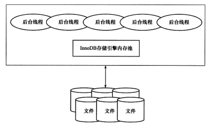
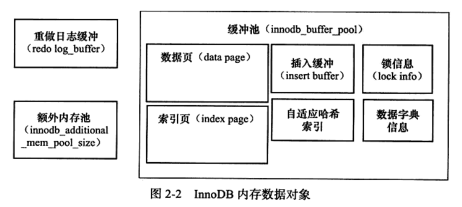
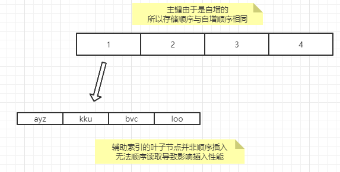
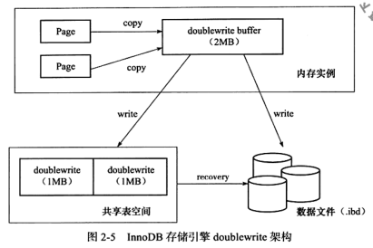

- [概述](#概述)
- [体系结构](#体系结构)
  - [后台线程](#后台线程)
  - [内存](#内存)
    - [缓冲池](#缓冲池)
    - [重做日志缓冲(`redo log buffer`)](#重做日志缓冲redo-log-buffer)
- [`Checkpoint`技术](#checkpoint技术)
- [`master thread`](#master-thread)
- [`innodb`关键特性](#innodb关键特性)
  - [插入缓冲](#插入缓冲)
    - [`insert buffer`](#insert-buffer)
    - [`change buffer`](#change-buffer)
    - [`insert buffer`内部实现](#insert-buffer内部实现)
    - [`merge insert buffer`](#merge-insert-buffer)
  - [两次写(`double write`)](#两次写double-write)
  - [自适应哈希索引(`adaptive hash index, AHI`)](#自适应哈希索引adaptive-hash-index-ahi)
  - [异步`IO`](#异步io)
  - [邻近页刷新(`flush neighbor page`)](#邻近页刷新flush-neighbor-page)
- [启动、关闭与恢复](#启动关闭与恢复)
# 概述
1. 第一个完整支持`ACID`事务的`MySQL`存储引擎
   * `atomicly`: 原子性
   * `consistency`: 一致性
   * `isolation`: 隔离性
   * `durability`: 持久性
# 体系结构

## 后台线程
1. `master thread`: 将缓冲池中的数据异步刷新到磁盘 
   * 刷新脏页
   * 合并`insert buffer`
   * 回收`undo`页等
2. `IO thread`: 
   * 使用`AIO`来处理写`IO`请求
   * 线程类型: 
     * `write thread`: 4个
     * `read thread`: 4个
     * `insert buffer thread`: 1个
     * `log IO thread`: 1个
   * `write thread`与`read thread`可以使用`innodb_read_io_threads`和`innodb_write_io_threads`设置
3. `purge thread`: 回收已经使用并分配的`undo`页
4. `page cleaner thread`: 刷新脏页
## 内存

### 缓冲池
1. 概念
   * 一块内存区域, 通过内存速度弥补磁盘速度
   * 缓冲池实例可以有多个, 每个页根据哈希值平均分配到不同缓冲池实例中
   * 表`information_schema.INNODB_BUFFER_POOL_STATS`可以查看缓冲池状态
2. 页: `innodb`基于磁盘存储, 记录按照页的方式进行管理
   * 默认为`16kb`
     * 支持压缩页
   * 对页的修改将首先修改缓冲池中的页
   * 然后通过`check point`的机制刷新回磁盘上
3. 缓存命中: 
   * 读取页(数据)时, 先将页放在缓冲池中
   * 下次读取相同的页时, 首先判断该页是否在缓冲池中. 若在, 则称为缓存命中, 直接读取页; 否则读取磁盘上的页
4. 缓冲池淘汰(`LRU list`与`Free list`)
   * `LRU list`
     * 通过`LRU(latest recent used, 最近最少使用)`算法管理
     * 频繁使用的页存放在`LRU list`的头部, 最少使用的在尾部. 当不能存放时, 首先释放`LRU list`中尾端的页
     * 新读取到的页, 放入`midpoint`处, 而不是放在`LRU list`的开头. 默认在`LRU list`的`5/8`处
     * `midpoint`之前的列表为`young`列表, 之后的列表为`not young`列表
   * `Free buffers`
     * `page made young`: 从`not young`列表转入`young`列表的操作
     * `page not made yound`: 由于`innodb_old_blocks_time`导致页没有从`not young`列表转入`young`列表的操作
5. `young`列表保护(热数据保护)
   * 使用`innodb_old_blocks_time`参数保护`young`列表
   * 即新读取到的页, 会首先插入到`midpoint`处, 即`old`列表的首部
   * 此页在`innodb_old_blocks_time`时间后被读取时, 会转移到`young`列表的头部
   * 此策略可以保证`young`列表中的数据会维持一段时间, 而不会被频繁更换  
    
6. 缓冲池相关参数
   * 修改缓冲池大小: `innodb_buffer_pool_size`
   * 修改缓冲池实例数量: `innodb_buffer_pool_instances`
   * 修改`midpoint`: `innodb_old_blocks_pct`
   * 修改`new`列表缓冲时间: `innodb_old_blocks_time`
7. 脏页(`dirty page`): 
   * 缓冲池中的页和磁盘中的页数据不一致 
   * `flush list`: 脏页列表
   * 脏页即存在于`LRU list`, 也存在于`flush list`中. 他们的职责不同, 互不冲突
### 重做日志缓冲(`redo log buffer`)
1. 日志大小: 
   * 由`innodb_log_buffer_size`控制, 默认`8MB`
2. 持久化的时机:
   * `master thread`每秒将`redo log`刷新到文件中
   * 每个事务提交时会将`redo log`刷新到文件中
   * 当`redo log`缓冲池剩余空间小于`50%`时, `redo log`刷新到文件中
# `Checkpoint`技术
1. 预写式日志(write ahead log): 
   * 当事务修改时, 先写`redo log`(重做日志)再修改页
2. `LSN(log sequence number)`: 
   * 用来标记日志版本
   * 8字节的数字, 单位是字节
   * `redo log`与`checkpoint`中都有`LSN`
3. `checkpoint`解决的问题:
   * 缩短数据库的恢复时间: 当`redo log`过大时, 会影响使用`redo log`恢复数据的时间(比如系统已经运行了很久时间)
   * 当缓冲池不够用时, 将脏页刷新到磁盘: 缓冲池不够时, `LRU`算法会释放最少使用的页, 如果是脏页则使用`checkpoint`将其刷新到磁盘
   * `redo log`不可用时, 刷新脏页
     * `redo log`是循环使用的  
          
4. `checkpoint`的类型
   * `sharp checkpoint`: 数据库关闭时将所有脏页刷新回磁盘
   * `fuzzy checkpoint`
5. `fuzzy checkpoint`的情况
   * `master thread checkpoint`: 每秒或每十秒从缓冲池中刷新一定比例的脏页
   * `FLUSH_LRU_LIST checkpoint`: 如果`LRU list`中没有足够的空闲页时, 会释放尾部的页, 如果其中有脏页, 则执行`checkpoint`
   * `async/sync flush checkpoint`: 
     * `redo log`不可用时, 刷新`flush list`中的脏页
      ```
      redo_lsn=已写入到redo_log的LSN
      checkpoint_lsn=已刷新回磁盘的最新页的LSN
      checkpoint_age=redo_lsn-checkpoint_lsn : 缓冲池数据与磁盘数据的版本差
      async_water_mark=75%*total_redo_log_file
      sync_water_mark=90%*total_redo_log_file
      ```
     * `checkpoint_age<async_water_mark`: 不刷新任何脏页数据到磁盘
     * `async_water_mark<checkpoint_age<sync_water_mark`: 触发`async flush`, 使得刷新后满足`checkpoint_age<async_water_mark`
     * `checkpoint_age>sync_water_mark`: 出发`sync flush`, 使得刷新后满足`checkpoint_age<async_water_mark`
   * `dirty page too much checkpoint`: 由参数`innodb_max_dirty_pages_pct`控制, 当脏页的数量达到参数值时, 强制进行`checkpoint`
# `master thread`
# `innodb`关键特性
## 插入缓冲
1. 概念
   * 与数据页一样, 是物理页的一部分
2. 使用条件
   * 索引是辅助索引(`secondary index`)
   * 辅助索引不唯一
3. 解决的问题
   * 当主键自增(`uuid除外`)时, 行的存储顺序是按照主键递增的顺序插入的 
   * 当有辅助索引并且不是唯一的辅助索引时, 数据页的存储依然按照主键的顺序, 但是辅助索引的叶子节点并不是按照顺序(时间类型除外)插入的
   * 因此需要磁盘的随机读取, 影响了插入的性能  
   
### `insert buffer`
1. **插入时**先判断辅助索引是否在缓冲池中, 若在则直接**插入**;若不在则先放入`insert buffer`对象中
2. 以一定的频率和情况进行`insert buffer`与辅助索引页子节点的`merge`
3. 影响: 在同一个索引页的插入操作可以合并到同一个`merge`操作中, 提升了**辅助索引的插入速度**
4. 问题: 在写密集的情况下, 插入缓冲会占用过多的缓冲池内存(`innodb_buffer_pool`)
### `change buffer`
1. 可以看作`insert buffer`的升级版
2. 不只缓冲`insert`, 可以对`insert`/`delete`/`update`都进行缓冲. 分别对应`insert buffer`/`delete buffer`/`purge buffer`
### `insert buffer`内部实现
1. 全局有一棵`insert buffer B+树`, 负责对所有表达辅助索引进行`insert buffer`
   * 存放在`datadir`的`idbdata1`中
   * 当使用独立表空间`ibd`文件恢复表中的数据时, 可能会出现由于辅助索引还在`insert buffer`中导致的`check table`的错误, 所以还需要使用`repair table`命令
2. 组成: 叶子节点与非叶子节点
3. 叶子节点: 存放的是`search key`  

4. 非叶子节点  

   * 为了保证`merge insert buffer`必须成功, 需要使用`insert buffer bitmap`记录每个辅助索引页的可用空间
   * `insert buffer bitmap`用来追踪16384个页, 存放在16384个页的第二个页中
   * `insert buffer bitmap`记录了:
     * 该辅助索引页的可用空间数量
     * 该辅助索引页有记录被缓存在`insert buffer`中
     * 该页为`insert buffer`索引页
### `merge insert buffer`
1. 触发`merge`的情况
   * 辅助索引页被读取到缓冲池中: 当查询该页时, `merge`新插入、未刷新的辅助索引
   * `insert buffer bitmap`发现辅助索引页无可用空间
   * `master thread`
## 两次写(`double write`)
1. 提高页的可靠性
2. `double write`: 当页被损坏时, 无法使用`redo log`正确的恢复数据. 即在使用`redo log`写入失效时, 通过页的副本还原该页, 再进行重做 
3. `double write`:  
      
   * 组成:
     * 内存中: `double write buffer`, 2MB
     * 物理磁盘的共享表空间中(`ibdata1`): 连续的128个页, 即2个区, 大小同样为2MB
   * 过程:
     * 刷新脏页时, 先通过`memcpy()`将脏页复制到内存的`double write buffer`中
     * 随后`double write buffer`每次1MB的顺序写入`ibdata1`中, 并调用`fsync()`同步磁盘
     * 完成后再将脏页刷新到各个表的空间文件中 
   * 相关参数:
     * 查看参数: `show global status like '%innodb_dblwr%'`;
     * 写入的页数: `Innodb_dblwr_pages_written`
     * 实际写入的次数: `Innodb_dblwr_writes`;
   * 页恢复: 表空间文件所属页崩溃时, 引擎会在`ibdata1`中找到该页的副本复制到该页, 再使用`redo log`重做 
4. 支持部分写失效机制的文件系统, 可以禁用`double write`
## 自适应哈希索引(`adaptive hash index, AHI`)
1. `AHI`通过缓冲池中的`insert buffer`构造得到, 引擎会根据访问的频率及模式来自动的为某些热点页建立哈希索引
2. 使用条件:
   * 对索引页的连续访问模式必须一致(指查询的条件一致)
   * 查询条件必须使用等值查询
   * 以该模式访问了100次
   * 页通过该模式访问了N次, 其中`N=记录*1/16`
## 异步`IO`
1. 数据库采用`异步IO(asynchronous IO, AIO)`的方式来处理磁盘操作
2. `AIO`的优势是可以进行`IO merge`
   * 比如请求访问的页`(space, offset)`为(8, 6)、(8, 7)、(8, 8), 那么只会发送一个`merge`后的`io`请求, 从(8, 6)开始读取到(8, 8)
3. 相关参数: `innodb_use_native_aio`
## 邻近页刷新(`flush neighbor page`)
1. 当刷新了一个脏页时, 引擎会检测该页所在区的所有页, 如果是脏页则一起刷新
2. 相关参数: `innodb_flush_neighbors`
# 启动、关闭与恢复
1. 参数`innodb_fast_shutdown`影响关闭时的行为:
   * 0: 关闭时完成所有`full purge`和`merge insert buffer`, 并且刷新所有脏页
   * 1: 默认值, 刷新缓冲池的脏页到磁盘
   * 2: 将日志写入日志文件, 数据库下次启动时, 会进行恢复操作
2. 参数`innodb_force_recovery`影响`innodb`存储引擎恢复的行为:
   * 0: 默认值, 需要恢复时则全部恢复, 恢复失败时停止启动并把错误写入错误日志