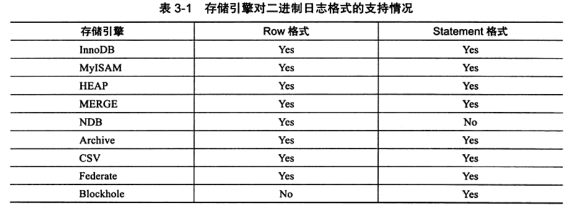
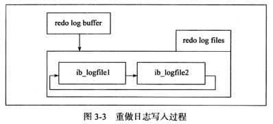

# 参数文件
1. 查看参数
   * `show variable like ''`
2. 参数类型
   * 动态参数: 可以在运行中进行更改
   * 静态参数: 在运行期间不可更改
# 日志文件
## 错误日志
1. 作用: 记录启动、运行、关闭的过程
2. 查看错误日志位置: `show variables like 'log_error'`
## 慢查询日志
1. 开启慢查询日志:
   * `set log_slow_queries=1`
   * `mysql8`: `set slow_query_log=1`
2. 日志位置
   * `mysql8`: `show variables like 'slow_queries_log_file'`
3. 日志记录时间(大于): `show variables like 'long_query_time'`
4. 未使用索引的记录(记录到慢查询日志中): 
   * 记录未使用索引的语句: `log_queries_not_using_indexes`
   * 限制每分钟记录到`slow_log`且未使用索引的语句次数: `log_throttle_queries_not_using_indexes`
     * 默认为0
5. `mysqldumpsslow`: 慢查询日志分析工具
6. 慢查询日志输出位置: `log_output`
   * `value=FILE`: 输出到文件
   * `value=TABLE`: 输出到`slow_log`表中
     * 默认`MyISAM`引擎, 更换引擎时需先关闭慢查询否则报错
## 查询日志
1. 记录了所有(无论是否成功执行)数据库请求
2. 默认开始: `general_log`
3. 文件位置: `general_log_file`
## 二进制文件(binary log)
1. 记录对数据库进行更改的全部操作, 不包括`select`和`show`
2. 用处
   * 恢复: 
   * 复制: 复制和执行`binlog`使从库与主库实时同步
   * 审计
3. 相关参数
   * `max_binlog_size`: `binlog`默认最大值, 默认1G(1,073,741,824KB). 超过该值后, 后缀名+1并记录到.index文件中
   * `binlog_cache_size`: 
     * 未提交事务的二进制日志在缓存中的最大值, 默认32KB
     * 每个事务都会被分配一个缓存
     * 超过大小时, 会把缓冲日志写入临时文件
     * `Binlog_cache_use`: 使用缓冲记录`binlog`的次数
     * `Binlog_cache_disk_use`: 使用临时文件记录`binlog`的次数
   * `sync_binlog`: `binlog`同步磁盘的方式
     * `1`: 写缓冲时同步写入磁盘, mysql8默认
     * `0`: 由文件系统控制缓存刷新
   * `binlog-do-db`: 需要写入的日志
   * `binlog-ignore-db`: 忽略写入的日志
   * `log-slave-update`: 从库设置与主库同步
   * `binlog_format`: 设置`binlog`的格式
     * `statement`: 记录逻辑sql语句
     * `row`: 记录表的行更改情况, 需要空间较大
     * `mixed`: 使用`statement`格式记录`binlog`, 会在以下情况使用`row`格式
       * 表的引擎为`NDB`
       * 使用了`uuid()`/`user()`/`current_user()`等函数
       * 使用了`insert delay`语句
       * 使用了用户定义函数(`UDF`)
       * 使用了临时表
         
4. `mysqlbinlog`: 查看`binlog`
   * 示例: `mysqlbinlog -vv --start-position=1065 test.00001`
# 套接字文件
1. 用处: `UNIX`系统下, 本地使用`UNIX`域套接字方式连接数据库
2. 文件位置: `show variables like 'socket'`
# `pid`文件
1. 用处: 在数据库启动时记录自己的进程id
2. 文件位置: `show variables like 'pid_file'`
# 表结构定义文件
1. mysql根据表进行存储, 每个表都会有与之对应的文件
2. `.frm`: 记录表、视图的定义, mysql8之后取消该文件
# `innodb`文件
## 表空间文件
1. 默认表空间: `innodb`将数据根据表空间(`tablespace`)存放, 即`ibdata1`文件
   * 文件位置: `show variables like 'innodb_data_home_dir'`
   * 使用多个文件:
   
2. 独立表空间: 设置`innodb_data_file_path`, 只能修改配置文件
   * 命名规则: `表名.ibd`
   * 仅存储该表的数据、索引、`insert buffer bitmap`等
## `redolog`
1. 文件名: `ib_logfile0`、`ib_logfile1`
2. 用处: 记录关于事务的日志
3. 每个`innodb`下必须有一个`redolog group`, 每个组下至少有2个`redolog file`
   * 高可用: 可以设置多个镜像日志组, 将文件放到不同的磁盘上
4. 日志结构
   
   * `redo_log_type`: 日志类型, 1字节
   * `space`: 空间id
   * `page_no`: 页的偏移量
   * `redo_log_body`: `redolog`的数据部分
5. 写入方式: 
   
   * 每个`redolog group`中的`redolog file`的大小一致, 每个文件循环写入
   * 当`ib_logfile0`写满后, 切换到文件组中的下一个文件继续写
   * 当所有文件都被写满后, 重新切换至`ib_logfile0`重新写入
   * 每次写入一个扇区(`512byte`), 
6. 相关参数
   * `innodb_log_file_size`: `redolog`的大小
     * 设置过大会影响恢复时间
     * 设置过小会可能会导致一个事务需要多次切换日志文件; 可能会导致频繁发生`async checkpoint`
   * `innodb_log_files_in_group`: `redolog group`的数量
   * `innodb_mirrored_log_groups`: 日志镜像文件组的数量
   * `innodb_log_group_home_dir`: 日志文件组所在路径, 默认为`.\`
7. 与`binlog`的区别
   * `binlog`记录所与mysql有关的日志记录, 包括其他引擎的日志; `redolog`只记录与`innodb`相关的事务日志
   * `binlog`记录的是一个事务的具体操作内容(`sql`); `redolog`记录的是每个页(`page`)更改的物理情况
   * `binlog`在事务提交前提交, 即只写一次磁盘; 而在事务进行的过程中, 不断有`redolog`被写入