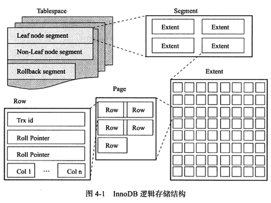

- [索引组织表](#索引组织表)
- [逻辑存储结构](#逻辑存储结构)
  - [表空间](#表空间)
  - [段](#段)
  - [区](#区)
  - [页](#页)
  - [行](#行)
- [行记录格式](#行记录格式)
  > 分析表的物理存储特征, 即数据在表中是如何组织及存放的

# 索引组织表

1. 索引组织表: 根据主键顺序存放的表
   - 主键的选择(下列条件依次判断)
     - 使用显式定义的主键
     - 使用表中的非空唯一索引
     - 上述都不成立, 则自动创建一个 6 字节大小的指针作为索引
   - 多个非空唯一索引时: 根据索引的定义顺序选择第一个定义的非空唯一索引
   - `_rowid`: 查询时代表表的主键, 只适用单个主键的情况

# 逻辑存储结构

1. 所有数据放在表空间(`ibdata1`)中
2. 表空间由段(`segment`)、区(`extent`)、页(`page`)组成

## 表空间

1. 默认表空间: `ibdata1`
2. 用户表空间:
   - 设置`innodb_file_per_table=on`
   - 每张表内的数据可以单独放到一个表空间, 包含数据、索引、`insert buffer bitmap`

## 段

1. 常见段有: 数据段, 索引段, 回滚段等
2. 数据段为 b+树的叶子节点
3. 索引段为 b+树的非索引节点

## 区

1. 区由连续的页组成, 大小为`1MB`
   - 修改页大小: `innodb_page_size`
2. 为了保证页的连续性, `innodb`引擎一次申请 4, 5 个区
3. `innodb`引擎页默认为`16KB`, 即一个区有 64 个连续的页
   - 创建表时, 首先使用 32 个页来存放数据, 当使用完毕后再申请 64 个连续页

## 页

1. 是`innodb`磁盘管理的最小单位
2. 常见的页类型:
   - 数据页(`b-tree node`)
   - `undo`页(`undo log page`)
   - 系统页(`system page`)
   - 事务数据页(`transaction system page`)
   - 插入缓冲位图页(`insert buffer bitmap`)
   - 插入缓冲空闲列表页(`insert buffer free list`)

## 行

1. 按行存放
2. 每页最多存放`16KB/2-200`行的记录(7992 行)

# 行记录格式
