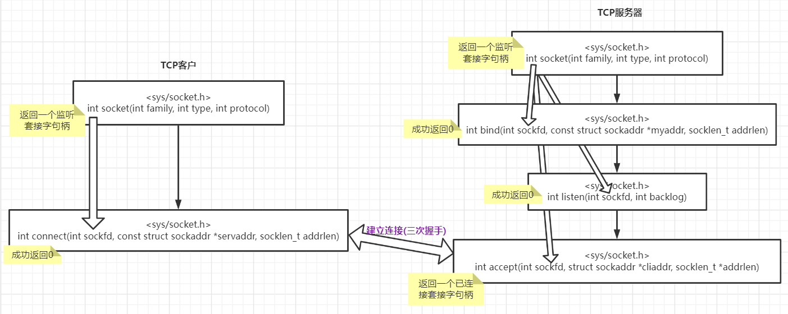

- [套接字函数](#套接字函数)
  - [句柄](#句柄)
  - [socket](#socket)
  - [connect/listen/accept](#connectlistenaccept)
  - [bind](#bind)
  - [close](#close)
  - [getsockname()/getpeername()](#getsocknamegetpeername)
  - [示例代码-时间服务器](#示例代码-时间服务器)
- [UNIX 多进程函数](#unix-多进程函数)

# 套接字函数

## 句柄

- 监听套接字(listening socket)句柄
- 已连接套接字(connected socket)句柄
- 区别
  - 数量: 一个服务器通常只创建一个监听套接字; 内核为服务器接收的每个连接创建一个已连接套接字
  - 生命周期: 监听套接字在服务器的生命周期中一直存在; 已连接套接字在三次握手完成时创建, 在连接关闭时销毁
  - 句柄创建函数
    - 监听套接字: `int socket(int family, int type, int protocol)`
    - 已连接套接字: `int accept(int sockfd, struct sockaddr *cliaddr, socklen_t *addrlen)`

## socket

- family. 协议簇

| family 取值 |    说明     |
| :---------: | :---------: |
|   AF_INET   |  IPV4 协议  |
|  AF_INET6   |  IPV6 协议  |
|  AF_LOCAL   | UNIX 域协议 |
|  AF_ROUTE   | 路由套接字  |
|   AF_KEY    | 密钥套接字  |

- type. 套接字类型

|   type 取值    |      说明      |
| :------------: | :------------: |
|  SOCK_STREAM   |     字节流     |
|   SOCK_DGRAM   |     数据报     |
|    SOCK_RAW    |   原始套接字   |
|    SOCK_RDM    |                |
| SOCK_SEQPACKET | 有序分组套接字 |

- protocol. 协议类型

| protocol 取值 |     说明      |
| :-----------: | :-----------: |
|    IPPROTO    | TCP 传输协议  |
|  IPPROTO_UDP  | UDP 传输协议  |
| IPPROTO_SCTP  | SCTP 传输协议 |

- [ ] SOCK_RDM 的作用
- [ ] 套接字类型在使用上的区别

## connect/listen/accept

- [ ] connect/listen 前使不使用 bind 的区别
- [ ] connect 异常情况
- [ ] backlog 的作用

## bind

- [ ] 指定或不指定地址/端口的区别

## close

- [ ] 用法

## getsockname()/getpeername()

## 示例代码-时间服务器

# UNIX 多进程函数
