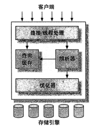
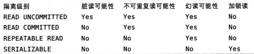

# `MySQL`逻辑架构

## 并发控制
1. `ACID`
   * `atomicity`: 原子性. 整个事务中的所有操作要么全部成功, 要么全部失败
   * `consistency`: 一致性. 总是从一个一致性状态转换到另一个一致性状态
   * `isolation`: 隔离性. 一个事务在提交前, 对其他事务是不可见的
   * `durability`: 持久性. 事务提交后会永久保存到数据库中
2. 隔离级别: 隔离级别规定了一个事务中所做的修改, 哪些在事务中和事务间是可见的, 哪些是不可见的

   * `read uncommitted`: 未提交读(脏读). 事务中的修改, 即使没有提交对其他事务也是可见的. 
   * `read committed`: 提交读(不可重复读). 事务开始时, 只能看见已经提交的事务所做的修改. 会有幻读问题
     * 幻读: 当前事务读取记录时, 另外一个事务又在该范围内插入了新的记录
   * `repeatable read`: 可重复读. 解决了`read committed`的幻读问题
   * `serializable`: 可串行化. 事务串行执行
3. 死锁: 值两个或多个事务在同一资源上相互占用, 并请求锁定对方占用的资源, 从而导致恶性循环的现象
   * `innodb`处理死锁的方法是: 将持有最少行级排他锁的事务进行回滚
4. 事务日志: 
   * 预写式日志(`write-ahead logging`):
     * 将事务的行为记录到顺序`IO`的事务日志中
     * 事务持久化到磁盘后, 内存中修改的数据会被慢慢刷新到磁盘
5. `MySQL`中的事务
   * `autocommit`: 当没有显式开始一个事务时, 每个查询都被当作一个事务执行. 默认为`1(on)`
     * 当该值设为`0(false)`时, 所有的查询在一个事务中, 直到显式的`commit`或`rollback`
6. **多版本并发控制(`MVCC`)**
   * 可以看作行级锁的一个变种, 在很多情况下避免了加锁操作
   * 基于通过保存数据在某个时间点的快照来实现. 
     * 即每个事务看到的数据是一致的, 与事务的执行时间无关
     * 每个事务开始的时间不同, 每个事务对同一张表同一时刻看到的数据是不一样的
7. **`innodb`的`MVCC`**:
   * 只在`repeatable read`和`read commit`两个隔离界别下生效
   * 系统版本号: 
     * 新开始一个事务, 自动递增
     * 存储在每行的隐藏列中
       * 一列保存了行的创建版本号(创建时间)
       * 一列保存了行的删除版本号(过期时间)
   * 事务版本号:
     * 用于和系统版本号比较
     * 事务开始时的系统版本号为当前事务版本号
   * 实现方式:
     * `select`: 
       * 只查找创建版本号早于当前事务版本的数据行
       * 行的删除版本号要么未定义, 要么大于当前事务版本号
     * `insert`: 为新插入的每一行保存当前系统版本号作为行的创建版本号
     * `delete`: 为删除的每一行保存当前系统的版本号作为行的删除版本号
     * `update`: 
       * 为插入一行新纪录保存当前系统版本号作为行版本号
       * 同时保存当前系统版本号到原来的行作为删除版本号