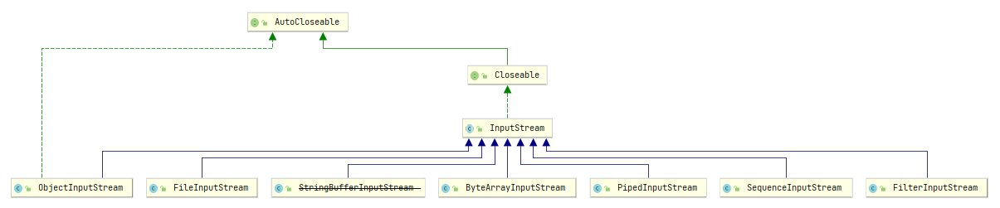
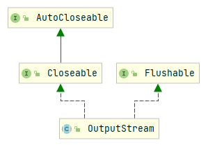
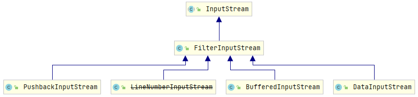
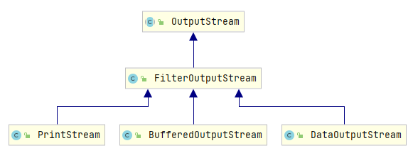
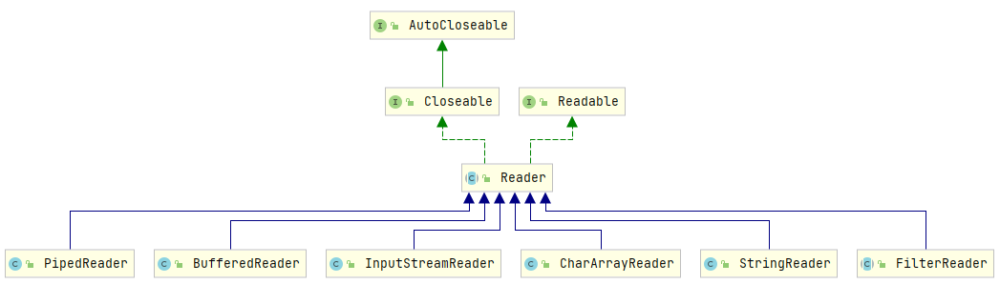

## `InputStream/OutputStream`

### 继承关系



1. `OutputStream`子类继承与`InputStream`相同, 不同的是`OutputStream`继承了`Flushable`接口  
   
2. `*Stream`
   - `InputStream`: 字节读操作相关方法, 类似`nio`的`ByteBuffer`、`netty`的`ByteBuf`. 如`read()`、`skip()`、`reset()`等
   - `OutputStream`: 字节写与刷新操作相关方法
3. 其余子类分别实现了特定功能, 如`FileInputStream`从文件中、`ByteArrayInputStream`从`byte[]`中读取数据; `FileOutputStream`将数据写到文件中
4. `FilterInputStream`
   
   - 是`InputStream`的一种特殊实现, 它将其它`InputStream`作为基本的数据源(装饰器模式)
     ```java
     protected FilterInputStream(InputStream in) {
         this.in = in;
     }
     ```
   - 图中只列出了`java.io`包下的子类, 在`java.util.zip`、`java.security`包下也有相应的子类
   - 例如`DataInputStream#readInt()`, 调用时读取 4 个`byte`, 再通过移位将数据组装成`int`
     ```java
     public final int readInt() throws IOException {
         int ch1 = in.read();
         int ch2 = in.read();
         int ch3 = in.read();
         int ch4 = in.read();
         if ((ch1 | ch2 | ch3 | ch4) < 0)
             throw new EOFException();
         return ((ch1 << 24) + (ch2 << 16) + (ch3 << 8) + (ch4 << 0));
     }
     ```
5. `FilterOutputStream`
   

## `Reader/Writer`

### 继承关系



1. `Readable`: 将字符读入指定的字符缓冲区, 一般与`Scanner`配合
2. `InputStreamReader`为`Reader`和`InputStream`的适配器, 将`InputStream`作为`Reader`的数据源

## 使用方法

1. `InputStream`的直接子类可以直接使用, 在有特殊需求时应使用`FilterInputStream`的子类. `OutputStream`同理
2. 在需要读取字符时应使用`Reader`子类
