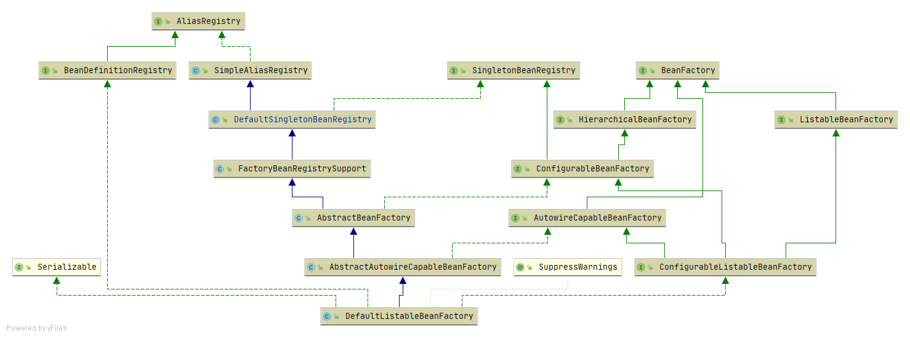
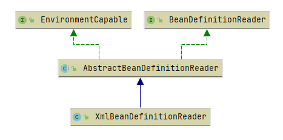

* 增: `add registry put`
* 删: `remove delete pop`
* 查: `get`
* 判: `is contain`
* 计: `count`

1. `AliasRegistry`
   * 定义对`alias`的增删查判操作
   * `bean`名与`alias`对应,同样为`String`
2. `BeanDefinitionDegistry`
   * 定义对`BeanDefinition`的增删查判计操作
   * `bean`名与`BeanDefinition`实例对应
3. `SimpleAliasRegistry`
   * `extends AliasRegistry`
   * 使用`Map<alias, name> $=new ConcurrentHashMap<>(16)`存储
   * 提供嵌套`alias`功能
4. `SingletonBeanRegistry`
   * 定义单例`bean`的增删查判计操作
5. `DefaultSingletonBeanRegistry`
   * `extends SimpleAliasRegistry implements SingletonBeanRegistry`
   * 存储不同状态下的`bean`
     * 创建完成的`bean`的集合: `Map<String, Object> singletonObjects = new ConcurrentHashMap<>(256)`
     * 创建完成的`bean`的名称集合: `Set<String> registeredSingletons = new LinkedHashSet<>(256);`
     * 创建未完成`bean`的`ObjectFactory`: `Map<String, ObjectFactory<?>> singletonFactories = new HashMap<>(16);`
     * 未完成初始化: `Map<String, Object> earlySingletonObjects = new HashMap<>(16);`
     * 未完成初始化的名称集合: `Set<String> singletonsCurrentlyInCreation =
			Collections.newSetFromMap(new ConcurrentHashMap<>(16));`
     * 被依赖的集合: 
       * `Map<String, Set<String>> dependentBeanMap = new ConcurrentHashMap<>(64)`
       * `key(String)`: `bean`
       * `value(Set<String>>)`: 所有依赖`key`的`bean`
     * 依赖的集合:
       * `Map<String, Set<String>> dependenciesForBeanMap = new ConcurrentHashMap<>(64)`
       * `key(String)`: `bean`
       * `value(Set<String>>)`: 所有`key`依赖的`bean`
6. `FactoryBeanRegistrySupport`
   * `extends DefaultSingletonBeanRegistry`
   * 定义了对`FactoryBean`的操作
7. `BeanFactory`
   * 是容器的注册中心, 集中了`bean`统一配置入口
   * `bean`的唯一标识是一个`String
   * `BeanFactory`要么返回原型, 要么返回单例
   * 定义了查判`bean`、`bean type`的一系列方法
8. `HierarchicalBeanFactory`
   * `extends BeanFactory`
   * 返回父`bean factory`的方法
   * 判断当前`bean factory`是否存在`bean`
9. `ConfigurableBeanFactory`
    * `extends HierarchicalBeanFactory, SingletonBeanRegistry`
    * 用于自定义配置`BeanFactory`, 例如
      * 配置`bean`的`scope`
      * 配置`ParentBeanFactory`、`ClassLoader`及`TempClassLoader`
      * 配置`spel`解析类, 解析
      * 配置`bean`属性转换解析类
      * 配置属性的类型转换器
      * 配置字符串解析器: 例如`${}`, 不确定与`spel`解析类的区别
      * 配置`BeanPostProcessor`
      * 配置`alias`解析类
      * 返回`merge`后的`BeanDefinition`
      * 判断`bean`的创建状态
      * 返回`bean`的依赖数组
      * 销毁`bean`
10. `ListableBeanFactory`
    * `extends BeanFactory`
    * 可以枚举出`bean`的名称, 而不是像`getBean(String name)`一样需要传入`bean`的名称, 例如
      * 根据名称返回名称数组或`map`
      * 根据类型返回名称数组`map`
      * 根据注解返回名称数组或`map`

1. `EnvironmentCapable`
   * 1