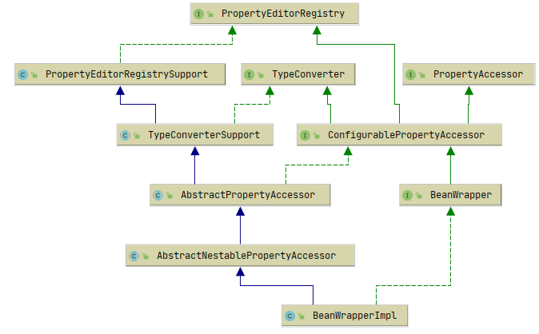

- [`Bean`组件](#bean组件)
  - [`BeanWrapper`](#beanwrapper)
    - [`property register`](#property-register)
    - [`type convert`](#type-convert)
    - [`property accessor`](#property-accessor)

# `Bean`组件

## `BeanWrapper`

### `property register`

### `type convert`

### `property accessor`
