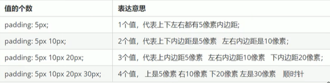

# 边框(`border`)

## 属性

1. `border-width`: 宽度
2. `border-style`: 样式
3. `border-color`: 颜色

# 内边距

1. 边框与内容之间的距离
2. 增加内边距会撑大盒子尺寸
3. 如果未指定`width/height`, 内边距不会撑开盒子
4. 计算盒子内容的宽、高时, 应该减去内边距

## 属性

1. `padding-left`: 左内边距
2. `padding-right`: 右内边距
3. `padding-top`: 上内边距
4. `padding-bottom`: 下内边距
   

# 外边距

1. 块级元素水平居中, 必须将左右外边距指定为`auto`
2. 行内元素与行内块元素实现水平居中, 需要给父元素添加`text-align:center`
3. 外边距合并: 父子块元素同时设置了上外边距
   - 为父元素定义上边框
   - 为父元素定义上内边距
   - 为父元素添加`overflow: hidden`

## 属性

1. `margin-left`: 左外边距
2. `margin-right`: 右外边距
3. `margin-top`: 上外边距
4. `margin-bottom`: 下外边距

# 其他

1. 清除内外边距

```css
* {
  padding: 0;
  margin: 0;
}
```

2. 行内元素一般设置左右内外边距
