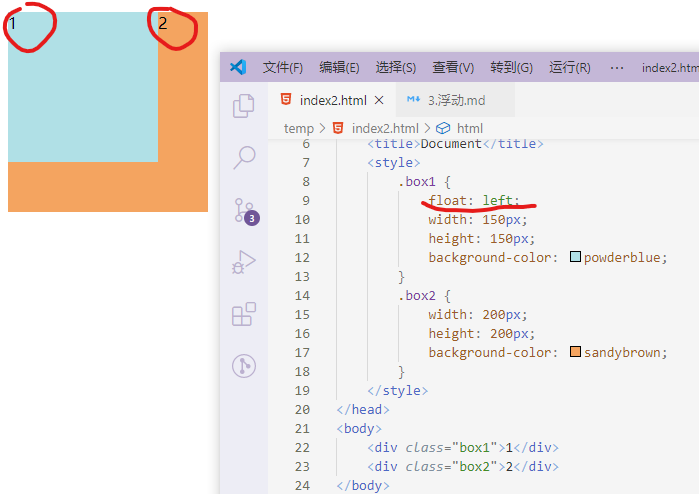
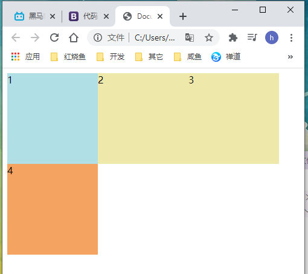
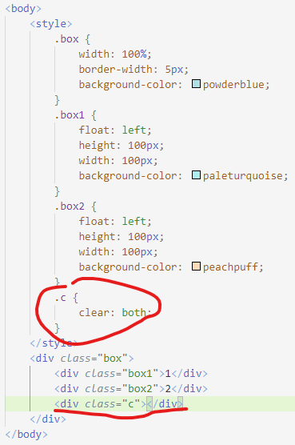
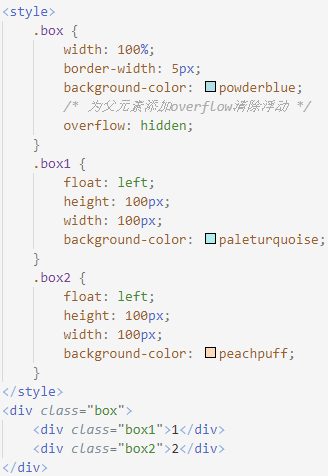
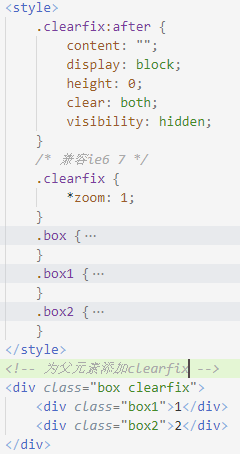
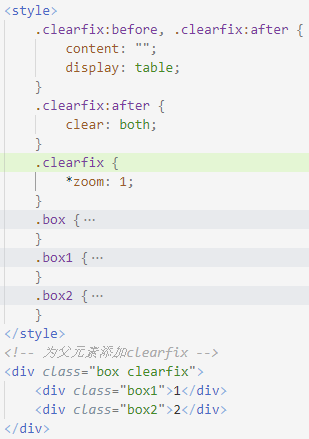
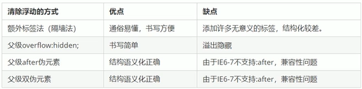

# 语法
1. `选择器 { float: 属性; }`
   * `none`: 不浮动, 默认
   * `left`: 左浮动
   * `right`: 右浮动
# 特性
1. 浮动会脱离标准流
   * 浮动的盒子不保留原先的位置
     * 原先的位置会按照标准流的规则, 被下边的元素占用
     * 当`.box1`设置`float`时, 原先的位置会被未浮动的`.box2`占用
        
   * 脱离标准普通流的控制, 移动到指定位置
2. 如果多个盒子都设置了浮动, 它们会按照属性值一行内显示并且顶端对齐
   * 浮动的元素紧贴在一起, 中间没有缝隙
   * 如果父级宽度装不下浮动的盒子, 多出的盒子会另起一行对齐
   
3. 浮动的元素具有行内块的特性
   * 行内元素添加浮动后, 会自动被赋予行内块元素的特点, 不需要指定`display`
4. 浮动元素常与标准流父级搭配使用
   * 先用标准流父级排列位置, 内部的子元素使用浮动
5. 浮动元素只会影响在它后面定义的元素的位置
6. 示例
```html
<!DOCTYPE html>
<html lang="en">
<head>
    <meta charset="UTF-8">
    <meta name="viewport" content="width=device-width, initial-scale=1.0">
    <title>Document</title>
    <style>
        .box1 {
            width: 600px;
            height: 300px;
            margin: 0 auto;
            background-color: palegoldenrod;
        }
        /* 页面左部, 左浮动 */
        .box2 {
            float: left;
            width: 200px;
            height: 100%;
            background-color: palegreen;
        }
        /* 页面右部, 右浮动 */
        .box3 {
            float: right;
            width: 400px;
            height: 100%;
            background-color: paleturquoise;
        }
        /* 清除默认的边距 */
        ul {
            margin: 0;
            padding: 0;
        }
        /* 设置浮动, 每排盒子的宽等于父级盒子的宽 */
        li {
            float: left;
            height: 150px;
            list-style: none;
            width: 100px;
        }
    </style>
</head>
<body>
    <div class="box1">
        <div class="box2">2</div>
            <ul class="box3">
                <li class="l1">1</li>
                <li class="l2">2</li>
                <li class="l3">3</li>
                <li class="l4">4</li>
                <li class="l5">5</li>
                <li class="l6">6</li>
                <li class="l7">7</li>
                <li class="l8">8</li>
            </ul>
    </div>
</body>
</html>
```
# 清除浮动
1. 在**父级盒子无法给出高度**的情况下, 内部子盒子如果设置浮动(脱标后父级高度为0, 不会撑开盒子), 会造成高度塌陷影响后边元素的位置, 此时需要清除浮动
2. 清除浮动的本质是清除浮动元素造成的影响(使父级高度为0)
3. 清除浮动后, **父级盒子会根据浮动的盒子自动检测高度**
4. 语法: `选择器 { clear:属性值; }`
   * `left`: 不允许左侧有浮动元素(清除左侧浮动影响)
   * `right`: 不允许右侧有浮动元素(清除右侧浮动影响)
   * `both`: 同时清除两侧浮动
5. 清除方法:
   * 额外标签法: 在最后一个浮动元素的后面添加额外的块级元素, 并对这个元素清除浮动
   
   * 父级添加`overflow`
   
   * `:after伪元素`: 相当于在最后新增了一个隐藏的块级元素撑开父级盒子
   
   * 双伪元素
   
6. 清除浮动方法比较
   