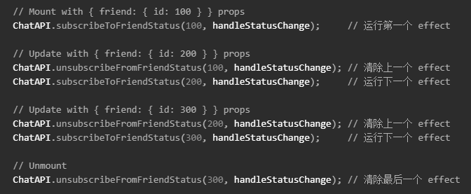

- [概念](#概念)
- [基础`Hooks`](#基础hooks)
  - [1. `useState`](#1-usestate)
  - [2. `useEffect`](#2-useeffect)
  - [3. `useContext`](#3-usecontext)
- [额外`Hooks`](#额外hooks)
  - [1. `useReducer`](#1-usereducer)
  - [2. `useMemo`](#2-usememo)
  - [3. `useCallBack`](#3-usecallback)
  - [4. `useRef`](#4-useref)
  - [5. `useImperativeHandle`](#5-useimperativehandle)
  - [6. `useLayoutEffect`](#6-uselayouteffect)
  - [7. `useDebugValue`](#7-usedebugvalue)
    > 1.`Hook`是`React 16.8`的新增特性。  
    > 2.它可以让你在不编写`class`的情况下使用`state`以及其他的`React`特性。

# 概念

1. `Hook`是`JavaScript`函数
2. 可以使用`Hooks`从组件中提取状态逻辑，使在无需修改组件结构的情况下复用状态逻辑
3. `Hook`将组件中相互关联的部分拆分、组合成函数，而并非强制按照生命周期划分（即相同逻辑的代码放在同一个函数中，由`useEffect`管理生命周期，而非像之前一样，将代码拆分到各个生命周期中）

# 基础`Hooks`

## 1. `useState`

```javascript
const [state, setState] = useState(initialState);
```

1. 返回一个变量`state`，以及更新`state`的函数`setState`。
2. `useState()`方法返回了一个数组，使用解构语法，可以将返回值设置为任意名称
3. 如果需要管理多个`state`，只需要调用多次`useState()`
   ```javascript
   const [age, setAge] = useState(42);
   const [fruit, setFruit] = useState("banana");
   const [todos, setTodos] = useState([{ text: "学习 Hook" }]);
   ```
4. 变量`state`
   - `state`初始值与`initialState`值相同
   - `initialState`可以是任何类型的值(`null`、`Number`、`String`、`Object`)
5. 函数`setState`
   - 用于更新`state`：`setState(newState);`
6. 使用：`<button onClick={() => setCount(count + 1)}>Click me</button>`

## 2. `useEffect`

```javascript
useEffect(effect: EffectCallback, deps?: DependencyList)
```

1. 可以看作`componentDidMount`、`componentDidUpdate`和`componentWillUnmount`这三个生命周期函数的组合
2. 执行条件
   - 每轮组件渲染后完成执行
   - 当`deps`未发生变化时，`useEffect`不执行
   - 当`deps`传递一个空数组时，`useEffect`只在组件挂载、卸载时执行
3. 返回值
   ```javascript
   useEffect(() => {
     ChatAPI.subscribeToFriendStatus(props.friend.id, handleStatusChange);
     return () => {
       ChatAPI.unsubscribeFromFriendStatus(props.friend.id, handleStatusChange);
     };
   });
   ```
   - 当组件卸载时，执行返回值中的内容
4. `useEffect`内部调用顺序
   
5. 函数`effect`
   - 是一个包含命令式、且可能有副作用代码的函数
     - 副作用：数据获取、订阅或者手动修改过`DOM`的操作
6. 变量`deps`：`effect`依赖的数据，当`deps`发生变化时，`useEffect`才执行

## 3. `useContext`

```javascript
const value = useContext(MyContext);
```

1. 接收`context)`对象(`React.createContext(defaultValue`)
2. 当组件上层最近的`<MyContext.Provider>`更新时，该`Hook`会触发重渲染
3. `useContext`等价与`static contextType = MyContext`或者`<MyContext.Consumer>`

# 额外`Hooks`

## 1. `useReducer`

```javascript
const [state, dispatch] = useReducer(reducer, initialArg, init);
```

1. `reducer`：用来操作`state`相关的函数
2. `state`：`redux`中的`state`
3. `dispatch`：`redux`中的`dispatch`。调用时，向`dispatch`中传入`action`
4. 指定初始值
   - `initialArg`：直接传递初始化参数，`state`的值为`initialArg`
   - `init`：使用辅助函数初始化，`state`的值为`init(initialArg)`
   ```javascript
   function init(initialCount) {
      return {count: initialCount};
   }
   function reducer(state, action) {
      switch (action.type) {
         case 'reset':
            return init(action.payload);
         default:
            throw new Error();
      }
   }
   function Counter({initialCount}) {
      const [state, dispatch] = useReducer(reducer, initialCount, init);
      ...
   }
   ```

## 2. `useMemo`

```javascript
React.useMemo<any>(factory: () => any,deps: ReadonlyArray<any> | undefined): any
const memoizedValue = useMemo(() => computeExpensiveValue(a, b), [a, b]);
```

1. 概念
   - 返回一个`memoized`<b>值</b>
   - `factory`：函数
   - `deps`：依赖数组，当依赖数组中的值改变时，重新计算`memoized`值
   - `React.useMemo(component)`用于判断组件内`component`中的值或组件是否发生变化，只有发生变化的值或组件才会重新渲染

## 3. `useCallBack`

```javascript
React.useCallback<(...args: any[]) => any>(callback: (...args: any[]) => any,deps: ReadonlyArray<any>): (...args: any[]) => any
```

1. 概念
   - 返回一个`memoized`<b>函数</b>
   - `callback`：函数
   - `deps`：依赖数组，当依赖数组中的值改变时，更新`memoized`回调函数
   - `useCallback(fn, deps)`相当于`useMemo(() => fn, deps)`
   - 只有当`deps`中的数值发生变化时，`fn`才允许执行
   - 在第一次执行`fn`后，`deps`才会被判断

## 4. `useRef`

```javascript
React.useRef(initialValue: T | null): React.RefObject
```

## 5. `useImperativeHandle`

```javascript
React.useImperativeHandle<unknown,{focus: focus, paste: paste}>(
   ref: ((instance: unknown) => void) | RefObject<unknown> | null | undefined,
   init: () => {focus: focus, paste: paste},
   deps?: ReadonlyArray<any>
): void
```

1. 概念
   - 将内部定义的`const inputRef = useRef()`暴露给父组件
   - `ref`：当前组件的`ref`
   - `init`：`ref`增强，可以在方法中为`ref`新增可以调用的方法。下例可以使用`this.ref.current.test()`调用`test`方法
   ```javascript
   useImperativeHandle(ref, () => ({
     test: () => {
       console.log(ref);
       inputRef.current.focus();
     },
   }));
   ```
   - 一般配合`React.forwardRef`使用，将组件内部的`ref`转发出去

## 6. `useLayoutEffect`

1. 在所有的`DOM`变更之后同步调用`effect`

## 7. `useDebugValue`

1. 在开发者工具中显示自定义`Hook`的标签
