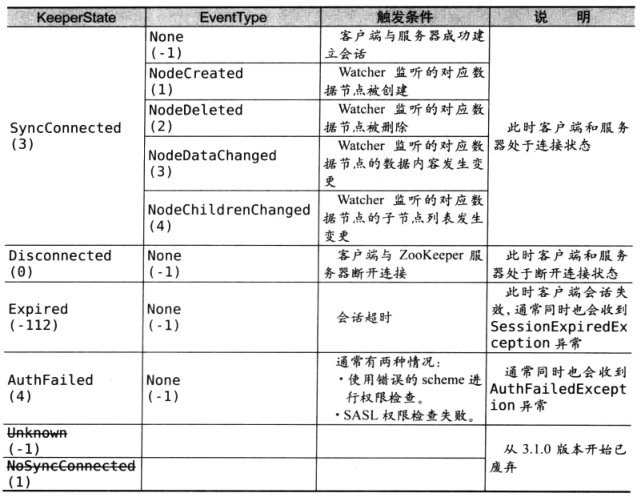

> version: 3.6.2

### `data model`

1. 使用具有层次结构的名称空间管理`znode`, 每个`znode`都可以拥有数据及子节点. 类似文件系统每个`znode`为一个路径, 到节点的路径表示为绝对的、斜杠分隔的路径: `/node1/node2`. 并没有相对路径的概念
2. `path`命名
   - 不允许使用`\u0000 - \u001F`、`\u007F`、`\u009F`、`\ud800 - \uF8FF`、`\uFFF0 - uFFFF`
   - 不允许单独使用`.`, `.`可以作为名称的一部分
   - `zookeeper`为保留字

### `znode`

1. `znode`维护了一个`stat`信息, 比如数据修改、`ACL`修改的版本号
2. 版本号随着数据的修改而增加, 客户端必须提供相应的版本号才能正确操作`znode`
3. 特性
   - `watches`: 客户端可以为一个`znode`设置`watches`, 对`znode`的修改会触发并清空`watches`. `zk`会向`watches`节点的客户端发送通知
   - `data access`: 每个节点的访问权限控制
   - `ephemeral nodes`: 临时节点. 会话结束后会删除, 不允许有子节点
   - `sequence nodes`: 可以在路径末尾附加一个单调递增的计数器, 计数器对于父节点来说是唯一的. 计数器的格式为`%010d`. 计数器由父节点维护

### `Stat Structure`

1. `zxid`: 事务`id`. 每次修改`zookeeper`状态会生成一个唯一的`zxid`, 可以用于表示修改的前后顺序
   - `czxid`: 创建时的`zxid`
   - `mzxid`: 最后修改此节点的`zxid`
   - `pzxid`: 最后修改子节点的`zxid`
2. `version numbers`:
   - 当节点被修改时`version numbers`会自增 1, 为乐观锁的实现
   - 赋值时版本使用`-1`则表明不使用乐观锁
   - `dataVersion`: 数据修改时自增.
   - `cversion`: 当前节点的下一级节点被修改时自增
   - `aclVersion`: 修改`ACL`时自增
3. `ctime`: 创建节点时的时间
4. `mtime`: 最后修改此节点的时间
5. `ephemeralOwner`: 如果此节点为临时节点, 值为节点拥有者的会话`id`; 否则为 0
6. `dataLength`: 数据的长度
7. `numChildren`: 子节点的数量

### `Session`

    

1. 连接时可以在`url`后附件节点路径: `localhost:2181/node1/node2`
2. `zk`会给连接的客户端分配会话`id`(64 位数字). `zk`会将随机创建的密码、会话`id`一起发送至客户端用于握手
3. 连接状态
   - `Expired`: 服务器会告诉客户端下一个租约的时间, 到达约定时间后若没有收到服务器新的租约时间, 则认为自己下线并废弃当前连接
   - `disconnected`: 客户端断开连接
   - `syncconnected`: 客户端与服务器建立连接后并完成`version`、`zxid`的同步

### `Watches`

1. 特性
   - `watches`只触发一次, 想要继续`watches`节点, 需要重新进行`watches`操作
     - `3.6.0`新增特性, 可设置`persistent watches`. 触发后不会删除; 并监听当前节点与子节点的修改
   - `watches`回调可以保证顺序执行, 监视事件的顺序与`zk`操作顺序相同
   - 客户端首先看到事件通知, 然后才能看到相应数据
2. `watches type`
   - `persistent watches`: 永久触发
   - `persistent recursive watches`: 永久触发, 不触发`NodeChildrenChanged`事件
   - `standard watches`: 只触发一次
     
3. `watches event type`
   - `NodeDataChanged`
   - `NodeChildrenChanged`
   - `NodeCreated`
   - `NodeDeleted`
   - `PersistentWatchRemoved`
   - `None`: 客户端服务器连接状态更改
4. 添加`watches`
   - 客户端
     - `getData()`、`exists()`: 设置数据`watches`
     - `getChildren()`: 设置子节点`watches`
   - `cli`: `addWatch path`
5. 方法与事件的关系
   | |exists()|getData()|getChildren()|
   |---|---|---|---|
   |created event|y|||
   |deleted event|y|y|y|
   |changed event|y|y||
   |child event|||y|

### `ACL`

1. 特性
   - `acl`类似`unix`的文件权限, 但是`zk`没有用户、用户组、所有者等等的概念, 而是使用`ids`来关联权限
   - `acl`只作用于特定`znode`, `acl`无法递归生效
   - `ids`使用`scheme:expression, perms`指定
     - `scheme`: 验证模式. `ip:1.1.1.1`表示使用`ip`验证
     - `perms`: 权限
       - `create`: 允许创建子节点
       - `read`: 允许获取数据、子节点列表
       - `write`: 允许修改数据
       - `delete`: 允许删除子节点
       - `admin`: 允许设置权限
   - 内置的`scheme`
     - `world`: 默认. `acl id`为`anyone`, 任何人都可以访问
     - `auth`: 可以使用`addauth`添加临时认证的用户用于访问节点. 访问节点时必需与`acl`匹配
     - `digest`: 用户名:密码的方式认证. `acl id`为`username:password`生成的`MD5`哈希值. 设定`acl`时, 密码必需为经过`sha1`、`base64`编码后的密文.
       - 生成命令: `echo -n <user>:<password> | openssl dgst -binary -sha1 | openssl base64`
     - `ip`: 使用客户端的`host+ip`作为`acl id`, 表达式为`addr/bits`
     - `x509`

### `consistency guarantees`

1. `sequential consistency`: 顺序执行客户端的请求
2. `atomicity`: 执行结果保证原子性
3. `single system image`: 无论客户端连接到哪个服务器看到的都是同样的视图
4. `reliability`
   - 确保当请求完全成功时才返回结果
   - 已经成功的请求永远不会回滚
5. `timeliness`: 在短时间内保证视图一致性

### 选举

1. 服务器状态
   - `looking`: 正在选举
   - `leading`: 当前服务器为`leader`
   - `following`: 当前服务器为`follower`

### 脑裂

### `ZAB`协议
