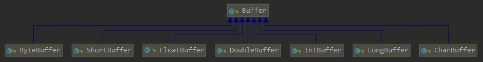
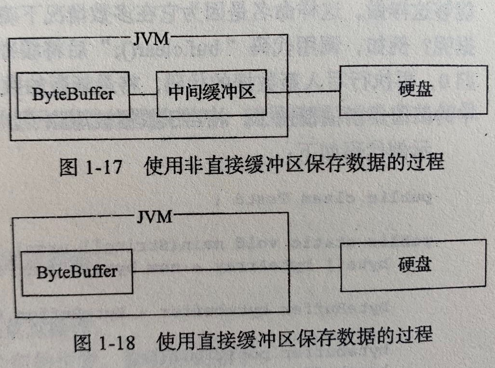
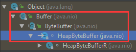

[TOC]

# Buffer

## 1. 介绍

> Buffer 是一个用于存储基本数据类型的容器，它以类似于数组有序的方式来存储和组织数据。

## 2. uml

- Buffer 类与其子类的继承关系，Buffer 与其子类为抽象类，无法直接实例化  
  

## 3. 核心概念

1. capacity 容量：缓冲区的大小
   1. 从 0 开始索引，capacity 表示最后一个可用的位置
2. limit 限制：
   1. 从 0 开始索引，limit 表示第一个无法被写入/读取的位置
   2. 不能为负
   3. 不能大于 capacity
3. position 位置：缓冲区当前位置，在读取、写入操作后，自动递增
4. mark 标记：标记
5. remaining 剩余空间：limit-position
6. 相对位置：从当前 position 操作一个或多个元素
7. 绝对位置：根据 index 位置操作元素，超出限制时`throw new IndexOutOfBoundsException()`

## 4. 初始化

#### 4.1 初始化

1. static ByteBuffer wrap(byte[] array,int offset, int length): 填充缓冲区
   ```java
   byte[] bytes = new byte[]{1, 2, 3};
   ByteButter.wrap(bytes);
   ```
2. static ByteBuffer allocate(int capacity): 分配一个 capacity 大小的缓冲区
   ```java
   ByteBuffer.allocate(3);
   ```
3. static ByteBuffer allocateDirect(int capacity): 分配新的直接缓冲区
   ```java
   ByteBuffer.allocateDirect(3);
   ```

#### 4.2 直接缓冲区与非直接缓冲区

1.  保存数据的过程  
    

    - 非直接缓冲区：每次需要将数据暂存到 jvm 的中间缓冲区
    - 直接缓冲区：
      - 在内核空间处理数据，减少了在 jvm 中创建中间缓冲区的步骤，提高了效率
      - 直接缓冲区善于保存受 I/O 操作影响的大量、长时间保存的数据

2.  判断是否为直接缓冲区
    ```java
    abstract boolean isDirect(): 为true则为直接缓冲区
    ```
3.  缓冲区类与非缓冲区类的底层实现类

    - `wrap()`、`allocate()`方法底层返回的是`new HeapByteBuffer()`
    - `allocateDirect()`方法底层返回的是`new DirectByteBuffer()`

4.  HeapByteBuffer  
    
    _ `HeapByteBuffer`为`ByteBuffer`的子类
    _ `ByteBuffer`的技术原理是使用 byte[]数组进行数据的保存，在后续使用指定的 api 操作这个数组 \* `HeapByteBuffer`重写了`ByteBuffer`的大部分方法，调用 api 时，执行的是`HeapByteBuffer`类中重写的方法
5.  DirectByteBuffer

    - 手动释放资源：通过反射拿到`cleaner()`，通过它的返回值得到`Cleaner`对象，再调用`Cleaner`对象的`clean()`

## 5. Buffer 主要方法

#### 5.1. 标志位操作

1.  limit
    ```java
    final int limit(): 返回当前limit
    final Buffer limit(int newLimit): 设置新的limit。0<newLimit<capacity
    ```
2.  position
    ```java
    final int position(): 返回当前position
    final Buffer position(int newPosition): 设置新的position。0<newPosition<limit。newPosition>limit时，limit=newPosition
    ```
3.  mark
    - 0<=mark<position
    - 当 limit、position 小于 mark 时，mark 被丢弃，此时 mark=-1
    ```java
    final Buffer mark(): 设置mark
    final Buffer reset(): 将当前position位置设置为mark的位置
    InvalidMarkException(): 当未定义mark并调用reset()时抛出
    ```

#### 5.2. 判断缓冲区状态

1. abstract boolean isReadOnly(): 判断是否为只读缓冲区
2. abstract boolean isDirect(): 判断是否为直接缓冲区
3. final boolean hasArray(): 当缓冲区为非直接缓冲区时，为 true
4. final boolean hasRemaining(): 判断 limit-position 是否为 0，为 0 时则为 true

#### 5.3. 获得缓冲区数据

1. final int arrayOffset(): 获得数组中第一个缓冲区元素的偏移量

#### 5.4. 缓冲区操作

1. final Buffer clear(): 还原缓冲区状态
   - position = 0;
   - limit = capacity;
   - mark = -1;
2. final Buffer flip(): 反转缓冲区，将当前 position 设为 limit，类似于截取子串
   - limit = position;
   - position = 0;
   - mark = -1;
3. final Buffer rewind(): 重置 position、mark，limit 未变。用于重新访问缓冲区
4. clear、flip、rewind 之间的区别与联系
   - `clear()`将缓冲区设为初始状态
   - `flip()`未限制 capacity，只是将缓冲区截成了 0-position 大小的区域（limit）
   - `rewind()`可以用于从头访问缓冲区

## 6. ByteBuffer 主要方法

#### 6.1. 缓冲区初始化

1. static ByteBuffer wrap(byte[] array, int offset, int length)
   - 由于缓冲区数组 hb 是原数组的引用，因此任意一方的修改都将导致另外一方修改
   - capacity = array.length，将 array 全量赋值给缓冲区
   - position = offset，offset 为赋值后，当前缓冲区的位置
   - limit = offset+length

#### 6.2. 单数据读写

1. abstract ByteBuffer put(byte b)
2. abstract byte get()
3. abstract ByteBuffer put(int index, byte b)
4. abstract byte get(int index)

#### 6.3. 批量数据读写

1. ByteBuffer put(byte[] src, int offset, int length)
   - 将目标数组引用到缓冲区中
   - 先检查 buffer 剩余大小是否足够。若 length>buffer.remaining()，`throw new BufferOverflowException()`
   - offset：src 的偏移量，从 0 开始。0<=offset<src.length
   - length：从 src 中读取的数量，0<offset+length<=src.length
2. ByteBuffer get(byte[] dst, int offset, int length)
   - 将缓冲区引用到目标数组
   - 先检查 buffer 剩余大小是否足够。若 length>buffer.remaining()，`throw new BufferUnderflowException()`
   - offset：dst 的偏移量
   - length：写入 dst 的数量
   ```java
   byte[] bytes = new byte[buffer.capacity()];
   buffer.get(bytes, 2, 4);
   ```
3. ByteBuffer put(ByteBuffer src): 将 src 剩余的数据（src.remaining()）赋值给当前缓冲区

#### 6.4. 缓冲区操作

1. 创建新的引用子缓冲区：`abstract ByteBuffer slice()`
   - 创建新的字节缓冲区。`newBuffer.capacity = limit - position`
   - 为源缓冲区的引用子序列，即一方修改内容，另一个也会被修改
   - 标志位独立。即 position、mark、limit 相互独立
   - 属性共享。即是否只读、是否为直接缓冲区是一致的
   - `newBuffer.arrayOffset()`为 newBuffer 第一个元素相对于源 buffer 的偏移
2. 创建新的引用缓冲区：`abstract ByteBuffer duplicate()`
   - 与`slice()`大致相同，不同点有
     - `duplicate()`是原缓冲区的全量复制，复制后`position`、`limit`、`capacity`与原缓冲区相同
     - `newBuffer.arrayOffset()`返回 0
   - 相同点
     - 标志位复制完成后是独立的
     - 属性共享
3. 创建只读缓冲区：`abstract ByteBuffer asReadOnlyBuffer()`
   - 不允许修改内容
   - 标志位独立。即 position、mark、limit 相互独立
   - 初始化后 capacity、limit、position、mark 与原缓冲区相同
4. 压缩缓冲区：abstract ByteBuffer compact():
   - 将当前 position 到 limit 之间的数据复制到缓冲区的开始
   - 压缩后的 position 为压缩前 limit-position 的数量
   - 压缩后的 limit = capacity
5. 扩容缓冲区
   - 步骤 1，创建一个新的`ByteBuffer`，分配足够大的空间
     ```java
     ByteBuffer.allocate(buffer.capacity() + extendSize);
     ```
   - 步骤 2，将原数据`put`到新缓冲区中
6. 获得缓冲区长度
   - 字节缓冲区长度：返回长度
   - 字符缓冲区长度：返回[`position`,`limit`)之间的字符数

##### 6.4.4. 比较(以 ByteBuffer 为例)

1.  `equals()`主要比较`position`到`limit`之间的内容是否一致
    1. 判断是不是自身，如果为自身，则返回`true`
       ```java
       if (this == ob)
           return true;
       ```
    1. 判断是否为`ByteBuffer`的子类，如果不为子类，返回`false`
       ```java
       if (!(ob instanceof ByteBuffer))
           return false;
       ```
    1. 判断剩余`remaining`是否相等，如果不相等，返回`false`
       ```java
       ByteBuffer that = (ByteBuffer)ob;
       if (this.remaining() != that.remaining())
           return false;
       ```
    1. 判断`remaining`中的内容是否相同，如果不相同，返回`false`
       ```java
       int p = this.position();
       for (int i = this.limit() - 1, j = that.limit() - 1; i >= p; i--, j--)
           if (!equals(this.get(i), that.get(j)))
               return false;
       ```
2.  `compareTo()`将缓冲区与另一个缓冲区按照顺序比较它们剩余元素的序列

    1.  以当前`ByteBuffer`的当前位置开始；以两个`ByteBuffer`对象最小的`remaining()`值结束。即判断`remaining()`的交集
        ```java
        int n = this.position() + Math.min(this.remaining(), that.remaining());
        ```
    2.  如果在`remaining()`的交集中，在当前比较的位置上出现了不同的字节，则返回两者的减数

        ```java
        for (int i = this.position(), j = that.position(); i < n; i++, j++) {
            int cmp = compare(this.get(i), that.get(j));
            if (cmp != 0)
                return cmp;

        private static int compare(byte x, byte y) {
            return Byte.compare(x, y);
        }
        ```

    3.  若每个字节都相同，则返回两者`remaining()`的减数
        ```java
        return this.remaining() - that.remaining();
        ```

#### 6.5. 缓冲区类型转换


1. 可以创建如上图所示的缓冲区视图
2. view.capacity = limit
3. 标志位独立。即 position、mark、limit 相互独立
4. 属性共享。即是否只读、是否为直接缓冲区是一致的
5. 容量根据对应视图所占的字节数决定
   - CharBuffer 为`src.remaining()`的一半。因为一个字符等于两个字节，ByteBuffer 为一个字节

#### 6.6. 缓冲区字节顺序

1. final ByteOrder order(): 获得字节顺序
2. static final ByteOrder BIG_ENDIAN: 字节顺序为从高到底
3. static final ByteOrder LITTLE_ENDIAN: 字节顺序为从低到高
