> 通道代表数据到硬件设备、文件、网络套接字的连接

# 1. `Channel`

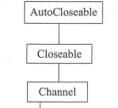

1. `isOpen()`:返回通道是否打开
2. 继承`AutoCloseable`可以自动关闭通道，也可以使用`close()`手动关闭通道

# 2. 子接口


## 2.1. 异步通道

1. `AsynchronousChannel`  
   
   1. 异步 IO 主要由以下两种方式实现
      1. 方法:`Future<V> operation()`
         1. operation:为操作方法
         2. V:结果的数据类型
         3. Future:Future 对象,用于检测操作是否完成等
      2. 回调:`void operation(..., A attachment, CompletionHandler<V,? super A> handler)`
         1. A 对象与`CompletionHandler`进行通信
         2. 使用`CompletionHandler`实现异步 IO
   2. 线程安全的
   3. 支持并发,但是不允许在未完成的 IO 操作上调用`read()`或`write()`
   4. 取消/离开通道:
      1. 支持`java.util.concurrent.Future#cancel`方法取消.会向等待的异常抛出`CancellationException`
      2. IO 能否被取消取决于底层实现
      3. 当取消当前操作离开通道时,会将通道置为一个错误的状态,会阻止接下来的`read()`或`write()`
      4. 当调用`cancel()`离开通道时,等待 IO 结果的线程会抛出`CancellationException`,通道中未完成的操作会抛出`AsynchronousCloseException`
2. `AsynchronousByteChannel`  
   
   1. 操作字节的异步 IO 通道
3. `InterruptibleChannel`  
   
   1. 可以异步的中断、关闭通道
   2. 其他线程可以调用阻塞线程的`interrupt()`方法关闭阻塞线程占用的通道。阻塞线程会收到`ClosedByInterruptException`异常。通道会处于中断状态

## 2.2. 读通道

### 2.2.1. 单字节读

1. `ReadableByteChannel`
   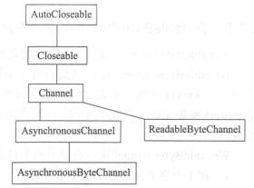
   1. 一次只允许一个写操作在进行

### 2.2.2. 多字节读

1. `ScatteringByteChannel`
   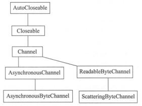

## 2.3. 写通道

### 2.3.1. 单字节写

1. `WritableByteChannel`  
   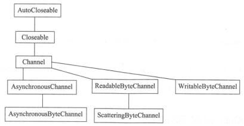
   1. 使通道可以写字节
   2. 一次只允许一个写操作在进行

### 2.3.2. 多字节写

1. `GatheringByteChannel`  
   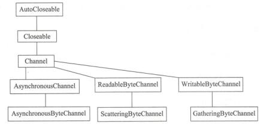

## 2.4. 读写通道

1. `ByteChannel`  
   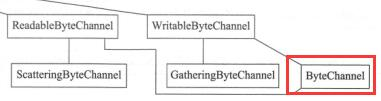
   1. 继承了`ReadableByteChannel`和`WritableByteChannel`，同时实现了通道的读和写的操作
2. `SeekableByteChannel`  
   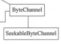
   1. 在通道中允许改变`position`

## 2.5. 网络通道

1. `NetworkChannel`  
   
   1. 与 socket 关联，使用 socket 技术发送通道中的数据
2. `MulticastChannel`  
   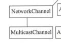
   1. 支持 IP 多播发送数据

# 3. 实现类

## 3.1. `AbstractInterruptibleChannel`

## 3.2. `FileChannel`

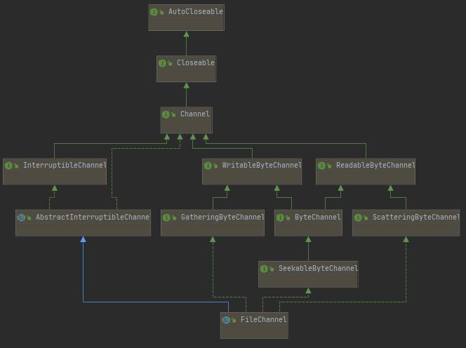

### 3.2.1. 特性

1. 读取、写入、映射和操作文件的通道。永远是阻塞的操作
2. 线程安全的。

### 3.2.2. 通道读写

1. 读取通道到缓冲区中

```java
FileInputStream stream = new FileInputStream(new File("data1.txt"));
FileChannel channel = stream.getChannel();
ByteBuffer buffer = ByteBuffer.allocate(5);
channel.read(buffer);
buffer.rewind();
```

2. 将缓冲区`remaining()`数据写到通道中

```java
FileOutputStream stream = new FileOutputStream(new File("data1.txt"));
FileChannel channel = stream.getChannel();
ByteBuffer buffer = ByteBuffer.wrap("12345".getBytes());
channel.write(buffer);
```

### 3.2.3. 通道操作

1. 截断缓冲区：`abstract FileChannel truncate(long size)`
   - 将此通道的文件截取为给定大小
   - 如果`size`<文件大小，则截取文件并丢弃文件末尾后面的字节
   - 如果`size`>=文件大小，则不修改文件
2. 将此通道文件传输到给定字节通道：`abstract long transferTo(long position, long count,WritableByteChannel target)`
   - 相当于`write()`方法
3. 从通道中读取字节到指定通道：`abstract long transferFrom(ReadableByteChannel src,long position, long count)`
   - 相当于`read()`方法
4. 强制写入设备：`abstract void force(boolean metaData)`
   - `metaData`：限制此方法必须执行的 IO 数量
     - `false`：将对内容的更新写入存储设备
     - `true`：必须写入对文件内容和元数据的更新，通常需要一个以上的 IO 操作
     - `metaData`依赖操作系统的具体实现
   - 显式的调用方法强制进行同步。即手动的将内核缓存中的数据写入到硬盘中
5. 通道文件区域映射到内存：`abstract MappedByteBuffer map(MapMode mode,long position, long size)`
   - `mode`：映射模式
     - `MapMode.READ_ONLY`：只读，修改缓冲区会抛出`ReadOnlyBufferException`异常
     - `MapMode.READ_WRITE`：读写，缓冲区的修改会传播到文件
     - `MapMode.PRIVATE`：专用，缓冲区的修改不会传播到文件，对其他程序不可见。会创建缓冲区已修改部分的副本
   - 映射的`position`为 0，`limit`、`capacity`为 size
   - `MappedByteBuffer`：文件的内存映射区域
     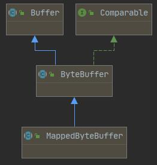
     - 父类为`ByteBuffer`
     - 功能上与普通的直接字节缓冲区完全相同
     - 新增方法：
       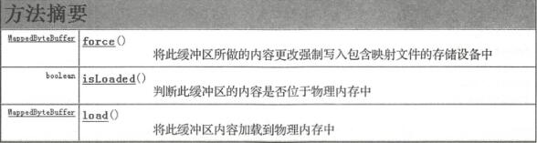
     - `abstract MappedByteBuffer map()`：
       ```java
       channel.map(FileChannel.MapMode.READ_ONLY, 0, channel.size());
       ```
     - `final MappedByteBuffer load()`：将缓冲区内容加载到物理内存中
     - `final boolean isLoaded()`：判断缓冲区内容是否位于物理内存中。windows 中永远返回`false`
6. 文件
   - 打开文件：`static FileChannel open(Path path, OpenOption... options)`
     - `path`：文件路径
     - `...options`：
       - `StandardOpenOption.CREATE`：如果不存在则创建文件，不能单独使用
       - `StandardOpenOption.APPEND`：追加文件
       - `StandardOpenOption.READ`：读文件
       - `StandardOpenOption.TRUNCATE_EXISTING`
         - 如果文件存在并且为写入访问而打开，则长度被截断为 0
         - 如果为读取访问打开文件，则忽略
       - `StandardOpenOption.CREATE_NEW`：创建新文件，如果文件已存在则抛出异常`FileAlreadyExistsException`
       - `StandardOpenOption.DELETE_ON_CLOSE`：关闭时删除
       - `StandardOpenOption.SPARSE`：创建稀疏文件
       - `StandardOpenOption.SYNC`：对文件内容或元数据的每次更新都同步写入底层设备
7. 通道状态
   - 判断通道是否打开：`final boolean isOpen()`

### 3.2.4. 通道锁定

1. 概念
   - 共享（读）锁：阻止其他并发运行的程序获取重叠的独占锁定，允许自己获取重叠的共享锁定。即其他线程可以获得同一文件的共享锁、同一文件部分内容的共享锁，但无法获得排它锁
   - 独占（写）锁：阻止其他程序获取共享或独占类型的重叠锁定。其他线程不能再获得同一文件的独占锁或共享锁，直到独占锁被释放
   - 锁的类型：`isShared()`
   - 锁的重叠状态：`overlaps()`，判断候选锁定范围是否与现有锁重叠
   - 锁类型的自动转换：当操作系统不支持共享锁时，共享锁自动转为独占锁
   - 锁的关系：
     - 共享锁-共享锁：非互斥
     - 共享锁-独占锁：互斥
     - 独占锁-共享锁：互斥
     - 独占锁-独占锁：互斥
2. 异常：
   - `AsynchronousCloseException`
     - 在通道锁定时，若另一个线程关闭了通道，则抛出异常
   - `FileLockInterruptionException`
     - 等待获取锁定时中断了线程调用，将状态设置为中断并抛出异常
     - 调用方法时设置自身的中断状态，则立即抛出异常
3. 方法
   - 锁：`abstract FileLock lock(long position, long size, boolean shared)`
     - shared：true 为共享锁，false 为独占锁
   - 整体独占锁：`final FileLock lock()`，内部调用有参`lock()`，默认获取通道文件的整体独占锁定
   - 区域锁：`abstract FileLock tryLock(long position, long size, boolean shared)`
     - 试图获得对此通道的文件给定区域的锁定
     - 结果不阻塞，立即返回
     - 无参方法默认获得整体文件的独占锁
4. `FileLock`：文件区域锁定的标记
   - 获得`FileLock`对象：`lock()`、`tryLock()`的返回对象
   - 释放`FileLock`对象
     - 调用`release()`
     - 关闭获得锁定的通道
     - 终止 jvm
