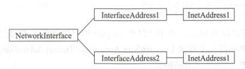

> `Socket`不是协议，是一种实现计算机之间通信的技术，而`HTTP`才是协议。
# 1. 常用方法
1. 获得基本信息
   * 获得`NetworkInterface`：
     ```java
     Enumeration<NetworkInterface> networkInterfaces = NetworkInterface.getNetworkInterfaces();
     ```
   * 迭代`NetworkInterface`：
     ```java
     while (networkInterfaces.hasMoreElements()){
        NetworkInterface networkInterface = networkInterfaces.nextElement();
     }
     ```
   * 获得网络设备名称：`String getName()`
     ```java
     networkInterface.getName();
     ```
   * 获得网络设备在操作系统中的显示名称：`String getDisplayName()`
   * 判断网络接口是否工作：`boolean isUp()`
   * 判断网络接口是否为回环接口：`boolean isLoopback()`
# 2. 获取`MTU`
1. `MTU`：Maximum Transmission Unit, 最大传输单元, 默认1500字节
2. 获得数据包：`networkInterface.getMTU()`
# 3. 子接口
1. 获取子接口：`networkInterface.getSubInterfaces()`
2. 判断当前网络接口是否为虚拟子接口：`networkInterface.isVirtual()`
   * 虚拟子接口的名称将是父网络接口的名称加上冒号`:`，再加上标识子接口的编号
   * 虚拟接口：软件模拟，无父网络接口
   * 虚拟子接口：软件模拟，有父网络接口
   * 虚拟接口不一定是虚拟子接口，虚拟子接口一定是虚拟接口
3. 获取父网络接口：`networkInterface.getParent()`
# 4. 硬件地址
1. 硬件地址：
   * 也称为物理地址，或`MAC`(Media Access Control, 媒体访问地址)
   * 定义网络设备的位置
   * 网卡设备的唯一ID
   * 16进制表示，48位
2. 获得网卡的硬件地址：
   ```java
   byte[] getHardwareAddress() throws SocketException
   networkInterface.getHardwareAddress()
   ```
# 5. IP地址
1. `NetworkInterface`、`InterfaceAddress`、`InetAddress`三者的关系
   
   * 每个`NetworkInterface`有多个`InterfaceAddress`对象
   * 每个`InterfaceAddress`有一个`InetAddress`对象
2. 获得`InetAddress`、`InterfaceAddress`
```java
Enumeration<NetworkInterface> networkInterfaces = NetworkInterface.getNetworkInterfaces();
while (networkInterfaces.hasMoreElements()) {
   NetworkInterface networkInterface = networkInterfaces.nextElement();
   Enumeration<InetAddress> inetAddresses = networkInterface.getInetAddresses();
   List<InterfaceAddress> interfaceAddresses = networkInterface.getInterfaceAddresses();
}
```
## 5.1. `InetAddress`，与IP地址相关的类
1. 获得`InetAddress`列表：
   ```java
    signature: Enumeration<InetAddress> getInetAddresses()
    Enumeration<InetAddress> inetAddresses = networkInterface.getInetAddresses();
   ```
   * 一个网络接口可以使用多个IP地址
   * `InetAddress`的子类`Inet4Address`、`Inet6Address`，分别代表IPv4、IPv6的地址信息
   * 迭代`Enumeration<InetAddress>`
   ```java
    while (inetAddresses.hasMoreElements()) {
        InetAddress inetAddress = inetAddresses.nextElement();
    }
   ```
2. 获得IP地址基本信息
   * 获得IP地址的完全限定域名（主机名+全路径，全路径中列出了序列中所有域成员）：
   ```java
   signature: String getCanonicalHostName()
   inetAddress.getCanonicalHostName()
   ```
   * 获得IP地址主机名：
   ```java
   signature: String getHostName()
   inetAddress.getHostName()
   ```
   * 获得IP地址字符串（即常见的IP地址格式x.x.x.x）：
   ```java
   signature: String getHostAddress()
   inetAddress.getHostAddress()
   ```
   * 获得`InetAddress`对象的原始地址
   ```java
   signature: byte[] getAddress()
   inetAddress.getAddress()
   ```
3. 获得本地主机和回环地址的基本信息
   * 获得本地主机的IP地址信息，如果有多个地址，则总是返回[0]
   ```java
   signature: static InetAddress getLocalHost() throws UnknownHostException
   InetAddress.getLocalHost()
   ```
   * 根据主机名获得所有IP地址，`host`可以为`hostname`、`IP`、`domain name`
   ```java
   signature: static InetAddress[] getAllByName(String host)
   InetAddress.getAllByName(host)
   ```
   * 获得回环IP地址
   ```java
   signature: static InetAddress getLoopbackAddress()
   InetAddress.getLoopbackAddress()
   ```
   * 根据主机名获得IP地址，`host`可以为`hostname`、`IP`、`domain name`
   ```java
   signature: static InetAddress getByName(String host)
   InetAddress.getByName(host)
   ```
   * 根据IP地址获得`InetAddress`对象，高位字节在`getByAddress()[0]`中
   ```java
   signature: static InetAddress getByAddress(byte[] addr)
   byte[] bytes = {-64, -88, 0, 102};
   InetAddress.getByAddress(bytes);
   ```
   * 根据主机名、IP地址获得`InetAddress`对象，主机名不做校验
   ```java
   signature: static InetAddress getByAddress(String host, byte[] addr) throws UnknownHostException
   ```
## 5.2. `InterfaceAddress`，与`InetAddress`对应的IP地址、掩码、广播地址等相关的类
1. 获得`InterfaceAddress`列表
   ```java
   signature: java.util.List<InterfaceAddress> getInterfaceAddresses()
   networkInterface.getInterfaceAddresses();
   ```
2. 常用方法
   * 返回此`InterfaceAddress`的`InetAddress`
   ```java
   signature: InetAddress getAddress()
   interfaceAddress.getAddress()
   ```
   * 返回此`InterfaceAddress`广播地址的`InetAddress`，只有IPv4有广播地址
   ```java
   signature: InetAddress getBroadcast()
   interfaceAddress.getBroadcast()
   ```
   * 返回此`InterfaceAddress`的网络前缀
   ```java
   signature: short getNetworkPrefixLength()
   interfaceAddress.getNetworkPrefixLength()
   ```
## 5.3. 点对点与广播
1. 点对点与单播的区别:
   * 单播：服务器与客户端之间通信
   * 点对点：没有服务器和客户端的概念
2. 是否为点对点设备：
   ```java
   signature: boolean isPointToPoint() throws SocketException
   networkInterface.isPointToPoint()
   ```
3. 是否支持多播
   ```java
   signature: boolean supportsMulticast() throws SocketException
   networkInterface.supportsMulticast()
   ```
   * 单播：大多数是点对点式的传播
   * 广播：一对多的形式，向网络中所有的计算机发送数据，不区分目标
   * 多播：也称为组播，也是一对多的形式。
     * 对IP地址进行分组，针对组内的计算机发送数据。
     * 一般通过多播IP地址（D类IP，224.0.0.0~239.255.255.255）实现。
## 5.4. 静态方法
1. 根据指定索引获得`NetworkInterface`对象
   ```java
   signature: static NetworkInterface getByIndex(int index) throws SocketException
   NetworkInterface.getByIndex()
   ```
2. 根据网络接口名称获得`NetworkInterface`对象，`name`可以为`hostname`、`IP`
   ```java
   signature: static NetworkInterface getByName(String name) throws SocketException
   NetworkInterface.getByName()
   ```