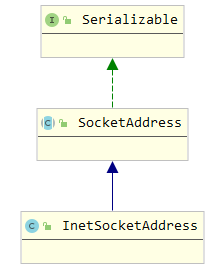
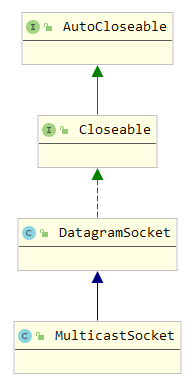

- [1. 基于`tcp`的`Socket`通信](#1-基于tcp的socket通信)
- [2. `tcp`的握手过程](#2-tcp的握手过程)
- [3. `ServerSocket`](#3-serversocket)
  - [3.1. 构造方法](#31-构造方法)
  - [3.2. 方法](#32-方法)
  - [3.e 相关类](#3e-相关类)
- [4. `Socket`](#4-socket)
  - [4.1. 方法](#41-方法)
- [基于`UPD`的通信](#基于upd的通信)
  - [概念](#概念)
  - [`socket`通信](#socket通信)
> `tcp`：基于`流`的`长连接`的数据传递，发送的数据带有`顺序性`  
> `tcp`：是一种流协议，以流为单位进行数据传递  
> `短连接`：`短连接`是当服务端与客户端连接成功后开始传输数据，传输完毕后立即关闭连接。再次传输数据需要建立新的连接   
> `长连接`：`长连接`是服务端与客户端进行3次握手后，进行多次通信。`长连接`就是复用当前的连接以达到多次通信的目的  
1. `短连接`优缺点：
   * 优点：不需要保存`socket`对象，降低内存使用率
   * 缺点：每次都要进行三次握手，增加处理时间
2. `长连接`优缺点：
   * 优点：复用连接提高程序运行效率
   * 缺点：在服务端保存多个`socket`对象，占用服务端资源
# 1. 基于`tcp`的`Socket`通信
1. 3次握手
2. 4次挥手
# 2. `tcp`的握手过程
# 3. `ServerSocket`
1. 创建服务端
## 3.1. 构造方法
1. ```ServerSocket(int port, int backlog, InetAddress bindAddr)```
   * `port`：端口
   * `backlog`：允许接受客户端连接请求的个数，默认50
   * `bindAddr`：指定客户端IP
       1. 默认为`0.0.0.0`
       2. 客户端初始化连接时，IP地址必须与`bindAddr`相同(`bindAddr`不为空时)
## 3.2. 方法
1. `accept()`: 侦听并接受套接字的连接，阻塞当前连接，返回`Socket`实例
2. 设置超时：```synchronized void setSoTimeout(int timeout)```
2. 绑定IP地址与端口：```void bind(SocketAddress endpoint, int backlog)```
2. 获得本地`SocketAddress`对象：`SocketAddress getLocalSocketAddress()`
2. 获得绑定的端口：`int getLocalPort()`
2. `inputStream.close()`: 关闭`steam`的同时也关闭了`Socket`
2. 关闭：`void close()`，所有阻塞的线程抛出`SocketException`
2. 判断是否关闭：`boolean isClosed()`，已经关闭则返回`true`
2. 端口复用：
   * 如果启用，主动关闭套接字连接的一方会进入`TIME_WAIT`状态，再”停留若干时间“，进入`CLOSED`状态。
   * 在”停留若干时间“内，程序可以使用`TIME_WAIT`状态的端口
   * 需在`bind()`之前开启
   * 开启端口复用：`void setReuseAddress(boolean on)`
   * 查看是否启用：`boolean getReuseAddress()`
2. 修改接收缓冲区大小：`SO_RCVBUF`

   * `void setReceiveBufferSize(int size)`
   * `SO_RCVBUF`是内部套接字接收缓冲区的大小、公布到远程同位体的TCP接收窗口(`win=66`)的大小
   * 需在`bind()`之前开启
## 3.e 相关类
1. `SocketAddress`  

   * ```InetSocketAddress(int port)```：传入端口创建套接字地址，传0时随机选择端口
   * ```InetSocketAddress(InetAddress addr, int port)```：根据IP地址与端口号创建套接字地址
   * ```InetSocketAddress(String hostname, int port)```：根据主机名与端口号创建套接字地址
# 4. `Socket`
1. 创建客户端。客户端需主动连接服务端
2. 获得`Socket`对象
   * 通过`accept()`方法获得
   ```java
   ServerSocket serverSocket = new ServerSocket();
   Socket socket = serverSocket.accept();
   ```
   * 通过构造方法获得
   ```java
   Socket socket = new Socket();
   ```
## 4.1. 方法
1. `getInputStream()`: 从输入流中获取数据，阻塞当前连接
2. 修改发送缓冲区大小：`SO_SNDBUF`
   * `void setSendBufferSize(int size)`
3. 半读
   * `void shutdownInput()`：开启端只能读不能写，另一端只能写不能读
   * 开启后，调用`InputStream getInputStream()`抛出`SocketException`
4. 半写
   * `void shutdownOutput()`：开启端只能写不能读，另一端只能读不能写
   * 开启后，调用`OutputStream getOutputStream()`抛出`SocketException`
5. `TCP_NODELAY`(`nagle算法`)
   * `nagle算法`服务端延迟发送`ACK`(确认延迟机制)，并将数据包缓存到本地，在延迟时间后将数据包与`ACK`一起返回客户端
   * 当数据包超过`MSS(Maximum Segment Size, 最大报文段长度)`时，数据立即发送
   * `MSS`计算公式：`MTU-20字节的TCP报头-20字节的IP报头`
   * `void setTcpNoDelay(boolean on)`：`true`为开启，反之为关闭
   * `nagle算法`适用于实时性要求不高的场景
6. 套接字关闭行为：`SO_LINGER`
   * 默认情况下，在执行`close()`方法后，底层的套接字会将发送缓冲区的数据发送给接收方后才真正的关闭
   * `void setSoLinger(boolean on, int linger)`：
     * `on=false`：默认行为，即进行四次挥手断开连接
     * `on=true,linger=0`：调用关闭方法时，立即中断连接，剩余数据丢弃，发送`RST`给接收方
     * `on=true,linger>65535`：`linger`设为`65535`
     * `on=true,linger<65535`：`linger`设为`linger`
     * `on=true,linger=5`：如果`linger`比较小时，会根据执行时长判断
       * 如果发送剩余数据需要`3s`，那么没有影响
       * 如果发送剩余数据需要`8s`，当执行`5s`时，发送`RST`给接收方并断开连接
7. 超时：`SO_TIMEOUT`
   * 阻塞读
   * 被阻塞前设定有效
   * `void setSoTimeout(int timeout)`
8. 紧急数据：`SO_OOBINLINE`
   * 所有的TCP紧急数据`OOB(out of bound, 带外数据)`通过套接字输入流接收
   * 禁用时，则丢弃紧急数据
9. `KEEP_ALIVE`：
   * 连接成功后的一段时间内，客户端会发送`ACK`嗅探服务端
   * `void setKeepAlive(boolean on)` 
10. 流量类别：
   * 规定了四种服务类型，用于描述服务质量。路由器或交换机会根据流量类别进行不同的处理
     * `IPTOS_LOWCOST(0x02)`：发送成本低       
     * `IPTOS_RELIABILITY(0x04)`：高可靠性       
     * `IPTOS_THROUGHPUT(0x08)`：高吞吐量
     * `IPTOS_LOWDELAY(0x10)`：最小延迟
# 基于`UPD`的通信
## 概念
1. `UPD(User Datagram Protocol, 用户数据报协议)`：面向无连接的传输层协议，提供不可靠的信息传送服务
2. 不可靠：通信时服务端与客户端不需要建立连接，直接将数据包从一段发送到另一端
3. 与`TCP`的不同点
   * 会丢包
   * 不提供数据包重传功能
   * 不提供对数据包进行分组、组装
   * 不能保证发送和接收的顺序
4. 与`TCP`的相同点
   * 都属于传输层协议   
4. 特点
   * 延迟小
   * 数据传输效率高
   * 数据最大长度为65507(`65535-IP协议头的20个字节-UDP协议头的8个字节`)
## `socket`通信
1. 客户端、服务端使用`DatagramSocket`
   * 发送数据：`void send(DatagramPacket p)`
   * 接收数据：`synchronized void receive(DatagramPacket p)`
2. 数据存放使用`DatagramPacket`
   * 获得数据（缓冲区）：`synchronized byte[] getData()`
   * 设置数据（缓冲区）：`synchronized void setData(byte[] buf, int offset, int length)`
     * `length`必须小于或等于`offset`与缓冲区长度之和
3. 单播
   * 连接时指定IP：`void connect(InetAddress address, int port)`
4. 组播
   * 使用`MulticastSocket`  
   
   * 加入多播组：`void joinGroup(SocketAddress mcastaddr, NetworkInterface netIf)`