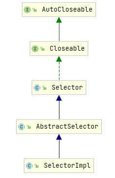
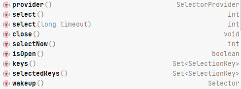
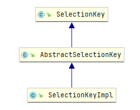
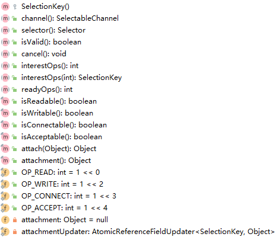

> 选择器(`Selector`)结合`SelectableChannel`实现了非阻塞的效果，提高了程序的运行效率
- [多路复用](#多路复用)
- [核心类](#核心类)
  - [核心类的关系](#核心类的关系)
  - [`SelectableChannel`](#selectablechannel)
    - [`ServerSocketChannel`](#serversocketchannel)
    - [`SocketChannel`](#socketchannel)
  - [`Selector`](#selector)
  - [`SelectionKey`](#selectionkey)
  - [`DatagramChannel`](#datagramchannel)
  - [`Pipe`](#pipe)
# 多路复用
1. 选择器的作用
   1. 将通道(`Channel`)注册到选择器(`Selector`)中，使用一个线程来对多个通道中的已就绪通道进行选择
   2. 使用一个线程操作多个通道可以避免CPU在不同线程间进行上下文切换
2. I/O多路复用
    
   * 使用多路复用可以降低内存使用率，因为线程的数量不高
   * 创建线程的数量根据通道的数量决定，每注册1023个通道就创建一个线程
# 核心类
## 核心类的关系

* `SelectableChannel`为线程模型中的通道, 即处理具体业务的组件
  * 需要向`Selector`注册
  * 常用的`SelectableChannel`有: `ServerSocketChannel`
  * 每个注册的`SelectableChannel`会有唯一的`SelectionKey`
    * 相同的`SelectableChannel`注册到不同的`Selector`时，返回的`SelectionKey`不同
    * 相同的`SelectableChannel`重复注册相同的`Selector`时，返回的`SelectionKey`相同
* `Selector`为线程模型中的选择器
  * `select()`返回`publicSelectedKeys`, 为已经准备就绪操作集的键的个数, `int`类型
* `SelectorKey`的`channel()`返回关联的`SelectableChannel`
* `SelectorProvider`为工具类, 例如`ServerSocketChannel#open()`默认由`SelectorProvider`实现
  ```java
  public static ServerSocketChannel open() throws IOException {
     return SelectorProvider.provider().openServerSocketChannel();
  }
  ```
## `SelectableChannel`
1. `SelectableChannel`继承关系
   
2. `SelectableChannel`子类继承关系  
   
3. 注册与注销
   1. 使用`register(Selector sel, int ops, Object att)`方法注册到指定`Selector`，注销之前保持注册状态
      1. `int ops`：为`SelectionKey`的常量  
        
   2. 可以使用`isRegistered()`判断是否注册了
   3. 注销必须使用`SelectionKey`的`cancel()`方法
   4. 当注销或者通道因异常关闭时，对应的`SelectionKey`自动取消
4. 阻塞与非阻塞
   * 通道一定处在阻塞、非阻塞模式中的一种
   * 阻塞模式：每次IO都会阻塞其他通道上的IO
   * 非阻塞模式：永远不会阻塞IO
   * 判断模式：`isBlocking()`
   * 通道注册前，必须将通道设为非阻塞模式（`configureBlocking(boolean block)`，为`true`时为阻塞模式）
### `ServerSocketChannel`
1. 继承关系

   * 实现了`NetworkChannel`
2. 获得`ServerSocketChannel`与`SocketChannel`
   * `ServerSocketChannel`：通过`static ServerSocketChannel open()`方法
     * 在通道上使用`bind()`后，`ServerSocket`不需要再使用`bind()`
   * `SocketChannel`：
     * 通过`ServerSocketChannel`的`SocketChannel accept()`方法
     * 通过`SocketChannel`的`open()`方法
     * 如果通道此时处于阻塞状态，在执行`accept()`时阻塞
     * 可通过`ServerSocketChannel`的`SelectableChannel configureBlocking(boolean block)`设置阻塞状态
3. 获得`ServerSocket`与`Socket`
   * `ServerSocket`：通过`ServerSocketChannel`的`ServerSocket socket()`
   * `Socket`：通过`SocketChannel`的`Socket socket()`
4. 获得`SelectProvider`：`SelectorProvider provider()`
5. 返回支持的操作：`int validOps()`
6. 阻塞锁：`Object blockingLock()`
7. `SocketOption`
   * 获得`SocketOption`
    ```java
    <T> T getOption(SocketOption<T> name)
    Set<SocketOption<?>> supportedOptions();
    ```
   * 设置`SocketOption`：`<T> NetworkChannel setOption(SocketOption<T> name, T value)`
### `SocketChannel`
1. 连接`ServerSocket`
   * `boolean connect(SocketAddress remote)`
   * 调用时遇到通道其他操作，则阻塞其他方法
   * 如果连接失败，则对通道调用其他方法会造成通道关闭
2. 阻塞与非阻塞
   * 阻塞模式比非阻塞模式耗时较多
   * 阻塞
     * 立即发起连接，连接成功时返回`true`；连接失败抛出异常
     * 调用方法时阻塞，直到连接成功或发生异常
   * 非阻塞：
     * 在随后的某个时间发起连接，调用时返回`false`
     * 此后必须使用`finishConnect()`验证连接是否成功
3. 判断是否进行连接
   * `boolean isConnectionPending()`
   * 已发起连接，但是未调用`finishConnect()`时，返回`true`
   * `accept()`之后、`close()`之前，返回`true`
4. `finishConnect()`：完成套接字通道的连接过程
## `Selector`
1. `Slector`为多路复用提供支持, 主要作用为选择可用的`SelectableChannel`
2. 继承关系  
   
3. 初始化`Selector`
   * 默认选择器：`Selector selector = Selector.open();`
   * 自定义选择器：`AbstractSelector abstractSelector = SelectorProvider.provider().openSelector();`
   * 在`windows`平台下, 实现类皆为`WindowsSelectorImpl`
5. 三种键集`Set<SelectionKey>`
   * 键集`SelectorImpl#publicKeys`: 当通道通过`register()`注册时，将其添加到此键集。由`keys()`方法返回
   * 已选择键集`SelectorImpl#publicSelectedKeys`: 在`select()`期间，检测每个键的通道是否准备就绪。由`selectdkeys()`方法返回
   * 已取消键集`AbstractSelector#cancelledKeys`: 
     * 已经被取消(执行`SelectionKey#remove()`或`Iterator<SelectionKey>#cancel()`), 但是未注销(`AbstractInterruptibleChannel#close()`)的通道集合。
     * 该键会被添加到已取消键集，在下一次`select()`中注销该通道，并在所有键集中移除
4. 主要方法
   
   * `wakeup()`: 
     * 使正在阻塞的第一个`select()`立即返回
     * 如果当前没进行选择操作, 则下一次操作立即返回
   * `selectNow()`: 
     * 非阻塞模式. 立即返回可用通道的数量(`publicSelectedKeys`), 如果没有则返回0
   * `select()`、`select(long timeout)`
     * 轮询所有注册的`SelectionKey`
     * 每次轮询必须`remove()`已经处理过的`channel`, 否则会出现消费重复的情况
     * 阻塞模式. 如果没有准备就绪的`channel`, 则一直阻塞
   * 中断或返回`select()`的情况
     * 已选择一个`channel`: 正常执行, 返回结果(`publicSelectedKeys`)
     * 调用`Selector`的`wakeup()`: 下一次`select`或`selectNow()`立即返回结果
     * 调用超时(`select(long timeout)`): 返回结果
     * 阻塞时使用`close()`: 中断, 抛出`CloseSelectorException`
     * 阻塞时使用`interrupt()`: 中断`select()`
   * `cancel()`与`close()`的区别
     * 被`cancel()`的通道会将`selectKey`放入`cancelledKeys`中, 并在下一次`select()`时在所有键集中删除此`selectKey`
     * `close()`与`cancel()`执行流程相同, 还会将相应的`SelectedChannel`从`Selector`中注销
5. `select()`执行过程
   * 将`cancelledKeys`中的每个`key`从所有键集中移除, 并注销改通道. `cancelledKeys`变为空集
     * 在`SelectorImpl#processDeregisterQueue()`中迭代`cancelledKeys`
     * 在`implDereg()`方法中完成在键集中移除`key`、关闭通道、修改`totalChannels`、`threadsCount`状态等操作
     * 将当前对象`(SelectorKeyImpl)`从`cancelledKeys`中移除 
## `SelectionKey`

1. 表示`SelectableChannel`在`Selector`中注册的标记
2. 主要方法
   
   * `SelectotionKey`内部维护的状态fu'gai
     * 通道的可操作集合: `private volatile int interestOps()`, 返回`interestOps`变量
     * 通道已经就绪的可操作集合: `private int readyOps()`, 返回`readyOps`变量
   * 可操作集合
     * `OP_READ`: 1
     * `OP_WRITE`: 4
     * `OP_CONNECT`: 8
     * `OP_ACCEPT`: 16
   * `isAcceptable()`、`isConnectable`、`isReadable()`、`isWritable()`操作使用`readyOps`与`interestOps`相与返回结果
     * `interestOps`为`SelectableChannel`注册`Selector`时指定的`ops`, `ops`既`OP_ACCEPT`等
     * 例如`isWritable()`的实现为: `return (readyOps() & OP_WRITE) != 0;`
   * `attachment`
     * `SelectableChannel`向`Selector`注册时可以添加附件
     * `SelectableChannel`注册后返回的`SelectotionKey`可以使用`attach()`添加附件
     * `SelectotionKey`可以使用`attachment()`获取添加的附件
3. 返回`SelectionKey`关联的选择器：`selector()`
4. 判断此键是否有效：`isValid()`
5. 取消：`cancel()`
## `DatagramChannel`
1. 获得对象：`DatagramChannel.open()`
2. `send()`、`receive()`在未连接时使用，系统会执行安全检查，造成额外的系统开销
3. `read()`、`write()`使用时必须建立连接
4. 判断是否连接：`isConnected()`
5. 连接：`connect()`
6. 断开连接：`disconnect()`
## `Pipe`
1. `Pipe`：实现单向管道传送的通道对
2. `Pipe.SinkChannel`：可写入结尾的通道
3. `Pipe.SourceChannel`：可读取结尾的通道