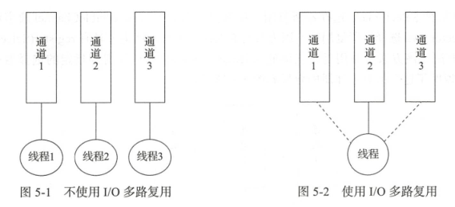
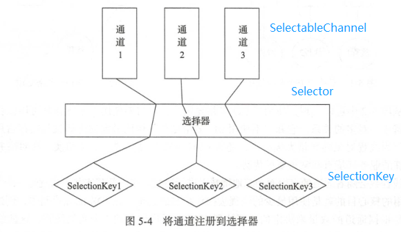
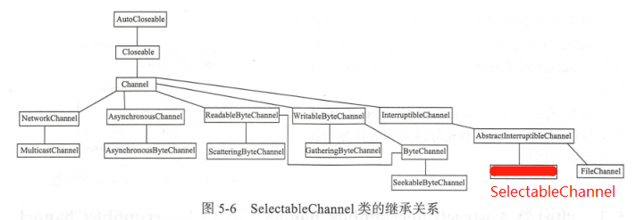
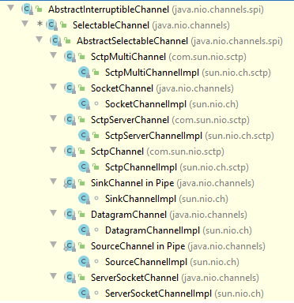
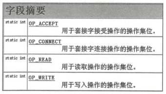
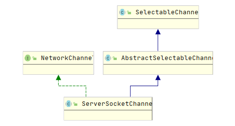

> 选择器(`Selector`)结合`SelectableChannel`实现了非阻塞的效果，提高了程序的运行效率
# 多路复用
1. 选择器的作用
   1. 将通道(`Channel`)注册到选择器(`Selector`)中，使用一个线程来对多个通道中的已就绪通道进行选择
   2. 使用一个线程操作多个通道可以避免CPU在不同线程间进行上下文切换
2. I/O多路复用
    
   * 使用多路复用可以降低内存使用率，因为线程的数量不高
   * 创建线程的数量根据通道的数量决定，每注册1023个通道就创建一个线程
# 核心类
## 核心类的关系

* `SelectableChannel`可以注册到指定的`Selector`中
* 每个注册后的`SelectableChannel`会有唯一的`SelectionKey`
    * 相同的`SelectableChannel`注册到不同的`Selector`时，返回的`SelectionKey`不同
    * 相同的`SelectableChannel`重复注册相同的`Selector`时，返回的`SelectionKey`相同
* 由`Selector`决定对哪个`SelectableChannel`中的数据进行处理
## `SelectableChannel`
1. `SelectableChannel`继承关系
   
2. `SelectableChannel`子类继承关系  
   
3. 注册与注销
   1. 使用`register(Selector sel, int ops, Object att)`方法注册到指定`Selector`，注销之前保持注册状态
      1. `int ops`：为`SelectionKey`的常量
        
   2. 可以使用`isRegistered()`判断是否注册了
   3. 注销必须使用`SelectionKey`的`cancel()`方法
   4. 当注销或者通道因异常关闭时，对应的`SelectionKey`自动取消
4. 阻塞与非阻塞
   * 通道一定处在阻塞、非阻塞模式中的一种
   * 阻塞模式：每次IO都会阻塞其他通道上的IO
   * 非阻塞模式：永远不会阻塞IO
   * 判断模式：`isBlocking()`
   * 通道注册前，必须将通道设为非阻塞模式（`configureBlocking(boolean block)`，为`true`时为阻塞模式）
## `ServerSocketChannel`
1. 继承关系

   * 实现了`NetworkChannel`
2. 获得`ServerSocketChannel`与`SocketChannel`
   * `ServerSocketChannel`：通过`static ServerSocketChannel open()`方法
     * 在通道上使用`bind()`后，`ServerSocket`不需要再使用`bind()`
   * `SocketChannel`：
     * 通过`ServerSocketChannel`的`SocketChannel accept()`方法
     * 通过`SocketChannel`的`open()`方法
     * 如果通道此时处于阻塞状态，在执行`accept()`时阻塞
     * 可通过`ServerSocketChannel`的`SelectableChannel configureBlocking(boolean block)`设置阻塞状态
3. 获得`ServerSocket`与`Socket`
   * `ServerSocket`：通过`ServerSocketChannel`的`ServerSocket socket()`
   * `Socket`：通过`SocketChannel`的`Socket socket()`
4. 获得`SelectProvider`：`SelectorProvider provider()`
5. 返回支持的操作：`int validOps()`
6. 阻塞锁：`Object blockingLock()`
7. `SocketOption`
   * 获得`SocketOption`
    ```java
    <T> T getOption(SocketOption<T> name)
    Set<SocketOption<?>> supportedOptions();
    ```
   * 设置`SocketOption`：`<T> NetworkChannel setOption(SocketOption<T> name, T value)`
## `SocketChannel`
1. 连接`ServerSocket`
   * `boolean connect(SocketAddress remote)`
   * 调用时遇到通道其他操作，则阻塞其他方法
   * 如果连接失败，则对通道调用其他方法会造成通道关闭
2. 阻塞与非阻塞
   * 阻塞模式比非阻塞模式耗时较多
   * 阻塞
     * 立即发起连接，连接成功时返回`true`；连接失败抛出异常
     * 调用方法时阻塞，直到连接成功或发生异常
   * 非阻塞：
     * 在随后的某个时间发起连接，调用时返回`false`
     * 此后必须使用`finishConnect()`验证连接是否成功
3. 判断是否进行连接
   * `boolean isConnectionPending()`
   * 已发起连接，但是未调用`finishConnect()`时，返回`true`
   * `accept()`之后、`close()`之前，返回`true`
4. `finishConnect()`：完成套接字通道的连接过程
## `Selector`
1. 获得`Selector`： 
   * 默认选择器`Selector`：`static Selector open()`
   * 自定义选择器：`AbstractSelector openSelector()`
2. 三种键集`Set<SelectionKey>`
   * 键集：当通道通过`register()`注册时，将其添加到此键集。由`keys()`方法返回
   * 已选择键集：在`select()`期间，检测每个键的通道是否准备就绪。由`selectdkeys()`方法返回
   * 已取消键集：
     * 已经被取消（执行`SelectionKey#remove()`或`Iterator<SelectionKey>#cancel()`），但是未注销（`AbstractInterruptibleChannel#close()`）的通道集合。
     * 该键会被添加到已取消键集，在下一次`select()`中注销该通道，并在所有键集中移除
3. 移除键集
   * `SelectionKey#remove()`
   * `Iterator<SelectionKey>#cancel()`
   * `AbstractInterruptibleChannel#close()`
4. 根据`Selector`找到`SelectorKey`：`SelectionKey keyFor(Selector sel)`
5. 选择`select()`：
   * `select(long timeout)`：阻塞模式，以下条件触发时返回
     * 至少选择一个通道
     * 调用`wakeup()`
     * 当前线程终端
     * 超时，`timeout`为0则无限阻塞
   * `selectNow()`：非阻塞
6. 唤醒`wakeup()`
   * 对尚未返回的第一个选择操作立即返回
   * 如果`select()`、`select(long)`正在阻塞，则该调用立即返回
   * 如果未进行选择，同时没有`selectNow()`时，下一次调用立即返回
## `SelectionKey`
1. 表示`SelectableChannel`在选择器中的注册的标记
2. 返回`SelectionKey`关联的选择器：`selector()`
3. 判断连接`SelectableChannel`相关的操作
   * `isAcceptable()`：测试通道是否可以接受新连接，与`e.readyOps() & OP_ACCEPT!=0`调用结果相同
   * `isConnectable()`：测试通道是否完成连接操作，与`e.readyOps() & OP_CONNECT!=0`调用结果相同
   * `isReadable()`：测试通道是否可以进行读取，与`e.readyOps() & OP_READ!=0`调用结果相同
   * `isWritable()`：测试通道是否可以进行写入，与`e.readyOps() & OP_WRITE!=0`调用结果相同
4. 判断此键是否有效：`isValid()`
5. 取消：`cancel()`
## `SelectProvider`
1. 用于选择器和可选择通道的服务提供者
## `DatagramChannel`
1. 获得对象：`DatagramChannel.open()`
2. `send()`、`receive()`在未连接时使用，系统会执行安全检查，造成额外的系统开销
3. `read()`、`write()`使用时必须建立连接
4. 判断是否连接：`isConnected()`
5. 连接：`connect()`
6. 断开连接：`disconnect()`
## `Pipe`
1. `Pipe`：实现单向管道传送的通道对
2. `Pipe.SinkChannel`：可写入结尾的通道
3. `Pipe.SourceChannel`：可读取结尾的通道