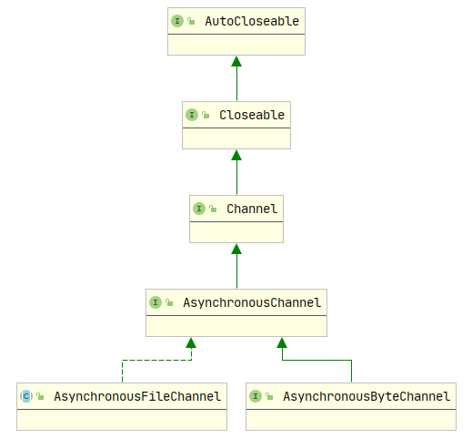

# AsynchronousFileChannel

1. 继承自`AsynchronousChannel`
2. 用于读取、写入和操作文件的异步通道
3. 获得对象：`AsynchronousChannel.open()`
# 异步、同步、阻塞、非阻塞的关系
1. 阻塞：方法不返回，直到读到数据或写出数据为止
2. 同步非阻塞：当前线程执行读写操作，如果读不到数据或者写不到数据时方法也立即返回。
3. 异步：多个线程间通信
4. 异步阻塞：a线程通知b线程，b线程的读写操作如果得不到数据，就是阻塞状态；如果得到数据，就通知并将数据返给a线程
5. 异步非阻塞：条件与上述一致，但是当b线程得不到数据时也立即返回执行后边的代码；当得到数据时，再通知a线程
6. 同步异步关心消息通知机制
7. 阻塞非阻塞关心结果的状态
8. IO请求分为两步
   1. 发起IO请求
   2. 实际IO操作
   3. 阻塞、非阻塞的区别在于第一步，即发起的IO是否会被阻塞。阻塞到完成即阻塞IO；不阻塞则是非阻塞IO
   4. 同步、异步的区别在于第二步
      1. IO读写阻塞进程，则是同步IO，所以阻塞IO、非阻塞IO、IO复用、信号驱动IO都是同步IO
      2. 如果不阻塞，而是操作系统完成IO再将结果返回给用户，就是异步IO