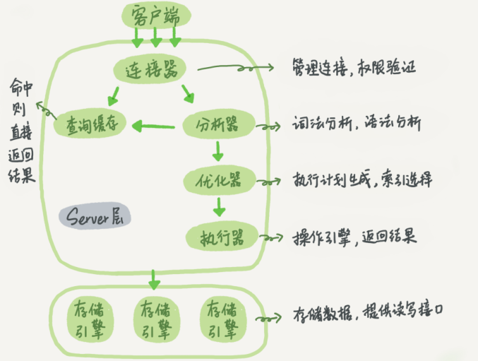
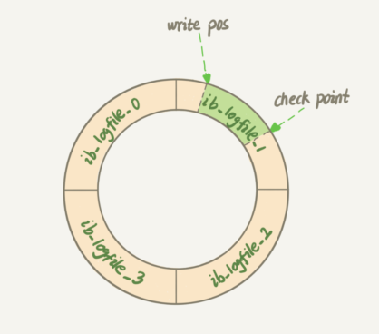
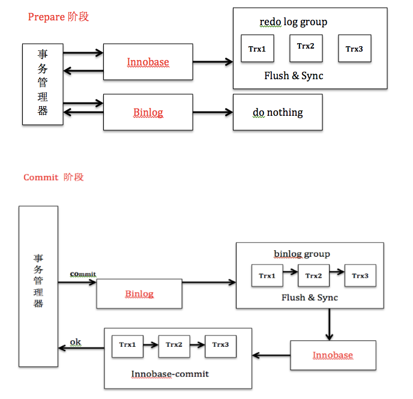
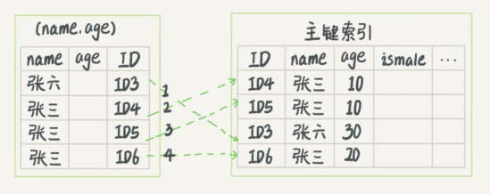

1. DML：增删改
2. DDL：修改表结构
# 执行流程

# 日志
1. `WAL(Write-Ahead Logging, 预写式日志)`：当有一条记更新时，`innodb`先把记录写到`redo log`里，更更新内存。引擎会在适当的时候将操作记录更新到磁盘里。
2. `redo log`：固定大小，可配置为4个文件，每个文件大小为1GB。从头开始写，写到末尾再回到开头循环写。可以保证数据库重启时，提交的记录不会丢失

   1. `write post`：当前记录的位置
   2. `checkpoint`：当前要擦除的位置
   3. 绿色部分是空闲区，可以用来记录新的操作
   4. 如果绿色部分满了，此时不能执行新的更新，要停下来擦除记录(推进checkpoint)
1. `binlog`：todo
2. `undo log`: 提供回滚与多版本并发控制(MVCC)
3. `redo log`与`binlog`的区别：
   1. `redo log`是`innodb`引擎独有的日志，`binlog`是`mysql`的`server`层实现的
   2. `redo log`是物理日志，记录在某个数据页上做了什么修改；`binlog`记录的是原始sql
   3. `redo log`是循环写，空间固定会用完；`binlog`可以追加写
4. 组提交：解决写日志频繁刷磁盘的问题
   1. `redo log`组提交：在提交事务时，为了避免磁盘页面的随机写，只将保证事务的`redo log`写入磁盘
   2. 组提交是：将多个事务的`redo log`的刷盘动作合并，减少磁盘顺序写
5. 组提交优化：
   1. 在开启`binlog`时，`prepare`阶段，会对`redo log`进行一次刷盘操作，确保data页和undo页的更新刷新到磁盘
   2. `commit`阶段会进行刷新`binlog`操作，并且会对事务的`undo log`从`prepare`设置为可提交状态
6. 两阶段提交

   1. 解决`binlog`与`redo log`的一致性
   2. `prepare`阶段：`innodb`刷新`redo log`，将回滚段(`undo log`)设为`prepared`状态
   3. `commit`阶段：`innodb`释放锁，释放回滚段，设置提交状态，刷新`binlog日志`。出现异常则回滚
# 事务
1. 隔离级别
   * 读未提交(read-uncommitted)：事务内的更改在未提交时就可以被其他事务访问到
   * 读提交(read committed)：事务内的更改在提交后才能被其他事务访问到。每个sql开始执行时创建一致性视图
   * 可重复读(repeatable read)：一个事务执行过程种看到的数据，与此事务在启动时看到的数据是一致的。事务开始时创建一致性视图
   * 串行(serializable)：同行记录必须获得锁权限才能进行操作
2. 启动事务的方式：
   * 显式启动：`begin`或`start transaction`
   * 手动启动：关闭`set autocommit`，执行任意语句即开启事务。需手动`commit`
3. 实现原理
   * 
# 索引
1. `innodb`索引模型
   1. 使用b+树索引模型，数据存储在b+树中
   2. 每一个索引对应一颗b+树
2. 索引类型
   1. 主键索引：也称聚簇索引。叶子节点存的是整行数据
   2. 非主键索引：也称二级索引。叶子节点存的是主键的值
3. 回表
   1. 在使用非主键索引查询时，要先查到主键的值，再去主键索引树查询真实数据，这个过程称为回表
4. 覆盖索引：索引已经覆盖了查询需求
   1. 如：现有索引主键索引和`k(name)`，需求为根据`name`查询`id`。则使用`select id from T where name=''`，由于索引树`k`叶子节点的值为主键`id`的值，所以不需要回表就得到了查询结果`id`
5. 最左前缀：
6. 索引下推：
   1. 如：现有前缀索引`k(name)`和普通索引`v(age)`，查询条件为`name like '%张' and age=10`
   2. 旧版本中前缀由于第一个为前缀索引，所以需要将所有符合条件的记录全部回表后取出，再判断另外的查询条件。
    
   3. 在5.6后，查询符合前缀索引的记录后，判断了另外的查询条件（列上必须有索引）后，再回表取出数据
    