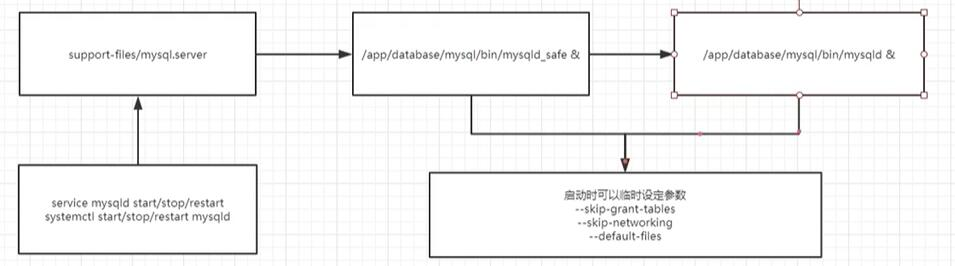

# 1.  版本选择
1.  5.6：5.6.36、5.6.38、5.6.40等
2.  5.7：5.7.20、5.7.22、5.7.24、5.7.26等
3.  8.0：8.0.11、8.0.17、8.0.18
# 2.  安装方式
1. 通用二进制安装
2. rpm、yum安装
3. 源码安装
# 3.  安装
 1.  清理MariaDB
 ```bash
 rpm -qa | grep mariadb
 yum remove mariadb-libs -y
 ```
 2.  创建用户和组：
 ```bash
 groupadd mysql
 useradd -r -g mysql -s /bin/false mysql
 ```
 3.  创建目录
 ```bash
 /usr/local: 软件mulu
 /binlog/3306: 日志目录
 /data/3306: 数据目录
 ```
 4.  解压和软链接
 ```bash
 tar zxvf /usr/local/mysql-5.7.28-linux-glibc2.12-x86_64.tar
 chown mysql:mysql mysql-5.7.28-linux-glibc2.12-x86_64
 chmod 750 mysql-5.7.28-linux-glibc2.12-x86_64
 ln -s /usr/local/mysql-5.7.28-linux-glibc2.12-x86_64 mysql
 cp support-files/mysql.server /etc/init.d/mysql.server
 ```
 5.  添加配置
 ```bash
 vim /etc/profile
 export PATH=$PATH:/usr/local/mysql/bin
 source /etc/profile
 ```
# 4.  初始化
```bash
yum install libaio-devel -y
rm -rf /data/3306/*
bin/mysqld --initialize-insecure  --user=mysql --basedir=/usr/local/mysql-5.7.28-linux-glibc2.12-x86_64 --datadir=/data/3306
bin/mysqld --initialize-insecure  --user=mysql --defaults-file=/etc/my.cnf：使用指定配置文件初始化
```
1.  初始化命令的区别
    1.  --initialize：生成root密码，登陆时使用`mysql -u root -p ${password}`
    2.   --initialize-insecure：不生成密码，登录时使用`mysql -u root --skip-password`
2.  配置文件读取顺序：`/etc/my.cnf /etc/mysql/my.cnf /usr/local/mysql/etc/my.cnf ~/.my.cnf`
3.  手动指定配置文件：`--defaults-file=/etc/my.cnf`
4.  手动指定配置项：`--port=3307`
# 5.  配置
1.  格式
```bash
[server]：服务端参数，包含mysqld、mysqld_safe等
[client]：本地客户端连接，不影响远程客户端。包含mysql、mysqldump等
```
1.  示例
```bash
vim /etc/my.cnf
[mysqld]
user=mysql
bashdir=/usr/local/mysql-5.7.28-linux-glibc2.12-x86_64
datadir=/data/3306
socket=/tmp/mysql.sock
server_id=6 ： 节点id，主从时使用
log_bin=/binlog/3306
port=3306
log-error=/var/log/mysqld.log
pid-file=/var/run/mysqld/mysqld.pid
[mysql]
socket=/tmp/mysql.sock
```
# 6.  启动
1.  启动：`bin/mysqld_safe --user=mysql &`或者`systemctl start mysqld`

2.  登录：`mysql -u root -p ${password}`或`mysql -u root --skip-password`
    1.  -h：指定host
    2.  -S：指定socket文件
    3.  -P：指定端口
    4.  -u：指定用户名
    5.  -p：指定密码
    6.  -e：免交互执行命令
    7.  <：导入sql脚本
3.  首次登录修改密码：`ALTER USER 'root'@'localhost' IDENTIFIED BY ${password};`
# 7.  升级
1.  二进制文件升级
    1.  替换旧版本升级
        1.  `mysql -u root -p --execute="SET GLOBAL innodb_fast_shutdown=0"`
        2.  关闭服务器：`mysqladmin -u root -p shutdown`
        3.  安装新版本mysql
        4.  使用现有的数据目录启动新版本mysql：`mysqld_safe --user=mysql --datadir=/path/to/existing-datadir &`
        5.  检查旧表是否兼容当前版本：`mysql_upgrade -u root -p`
        6.  重新启动mysql：`mysqladmin -u root -p shutdown`, `mysqld_safe --user=mysql --datadir=/path/to/existing-datadir &`
    2.  逻辑升级
        1.  导出数据：`mysqldump -u root -p  --add-drop-table --routines --events --all-databases --force > data-for-upgrade.sql`
        2.  安装新版本mysql并启动
        3.  导入数据：`mysql -u root -p --force < data-for-upgrade.sql`
        4.  （8.0）删除5.7旧表：`DROP TABLE mysql.event; DROP TABLE mysql.proc;`
2.  yum升级
    1.  选择8.0的yum发行库
    2.  `yum update mysql-server`
    3.  更新组件：`yum list installed | grep "^mysql"`, `yum update package-name`
# 8.  导入及导出表
1.  导出指定库的指定表：`mysqldump db_name t1 > dump.sql`；导入：`mysql db_name < dump.sql`
2.  导出指定库：`mysqldump db_name > dump.sql`；导入：`mysql db_name < dump.sql`
3.  导出所有库所有表：`mysqldump --all-databases > dump.sql`；导入：`mysql < dump.sql`
# 9.  多实例
## 9.1.  同版本多实例
1.  配置文件：在多实例中，下面配置文件的项每个实例都需不同
```bash
[mysqld]
user=mysql
bashdir=
datadir=
server_id=
log_bin=
port=
log-error=
pid-file=
```
2.  初始化：使用`mysqld --initialize-insecure --user= --datadir= --basedir=`初始化目录
3.  `systemd`启动脚本`mysql*.service`，存放在`/etc/systemd/system`
```bash
[Unit]
Description=MYSQL Server
Documentation=man:mysqld(8)
After=network.target
After=syslog.target
[Service]
User=
Group=
ExecStart=/mysqld --default-file=
ExecReload=
ExecStop=
KillMode=process
[Install]
WantedBy=multi-user.target
```
4.  启动：`systemctl start mysql*`
## 9.2. 不同版本多实例
1.  配置文件
2.  初始化
3.  启动脚本
4.  不同版本多实例可以使用同一个client连接，连接时使用`-S /tmp/mysql*.sock`