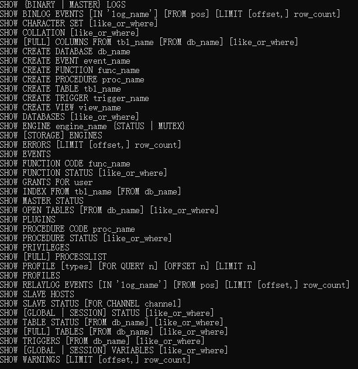

# 1. 概念

## 1.1. sql_mode：规定 sql 语法

1.  STRICT_TRANS_TABLES
2.  NO_ENGINE_SUBSTITUTION

## 1.2. 字符集(charset)与校对规则(collation)

1. 字符集
   1. utf8：单字符最大 3 字节
   2. uft8mb4：单字符最大 4 字节
2. 校验规则：影响排序顺序

## 1.3. 数据类型

1. tinyint：1 字节，0-255
2. int：4 字节，0-2^32-1
3. bigint：8 字节
4. char：定长字符串
5. varchar：变长字符串
   1. 与 char 的区别：varchar 需要多余的字节存储字符串的长度
   2. 数字与字母占一个字节，汉字占三个字节
6. enum：枚举。存储字符串类型
7. 时间：
   1. date: YYYY-MM-DD
   2. time: hh:mm:ss[.uuuuu]
   3. datetime: YYYY-MM-DD hh:mm:ss[.uuuuu]，占 8 个字节，1000-9999 年
   4. timestamp: YYYY-MM-DD hh:mm:ss[.uuuuu]，占 4 个字节，1970-2038 年，受时区影响
   5. year: YYYY
8. 二进制
   1. json：

## 1.4. 约束

1. primary key：唯一、非空
2. not null：非空
3. unique：唯一
4. unsigned：非负数
5. default：默认值
6. comment：注释

# 2. client 命令

1.  \G：格式化
2.  tee：指定文件，将接下来的操作与结果记录到文件中
3.  source：导入 sql 文件
4.  system：调用 shell 语句

# 3. DDL：数据定义语言

## 3.1. 库

1. create
   1. 库名小写
   2. 必须指定字符集
2. query
   1. `show database`
   2. `show create database ...`
3. update
   1. 修改字符集：尽量从小字符集改为大字符集`alter database # charset #`
4. delete：`drop database ...`

## 3.2. 表

1. create
   1. 不要大小写混用
   2. 设置存储引擎与字符集
2. update
   1. `alter table # add column # int not null`
   2. `alter table # modify #`
   3. `alter table # drop #`
3. delete
   1. `delete from #`：删除全部记录。未在磁盘中删除，磁盘空间没有立即释放，HWM 搞水位线不会降低
   2. `drop table #`：从数据库中删除表及数据
   3. `truncate table #`：删除全部记录。磁盘空间立即释放，HWM 搞水位线降低

### 3.2.1. query

1. mysql 特有语法
   - 配合内置函数：`select now()`
   - 计算：`select 10*100`
   - 查询数据库参数：`select @@port`
2. 标准用法
   - 子句执行顺序：`where`、`group by`、`select_list`、`having`、`order by`、`limit`
3. `join`
   - 笛卡尔积：`table1 join table2`
   - 内连接：`table1 join table2 on table1.id=table2.id`
   - 左外连接（左表所有数据）：`table1 left join table2`
   - 右外连接（右表所有数据）：`table1 right join table2`
4. `union`、`union all`
   - `union`：对两个结果集进行并集操作，不包括重复行，同时进行默认规则的排序
   - `union all`：对两个结果集进行并集操作，包括重复行，不进行排序

### 3.2.2. show

### 3.2.3. 元数据

1. 数据行记录：
   - myisam：.myd 文件
   - innodb：.ibd 文件
2. 索引：
   - myisam：.my1
   - innodb：.ibd
3. 数据字典，表中列的定义信息
   - myisam：.fm
   - innodb：(8.0 以前).fm、ibdata1
4. 数据库状态：mysql、sys、i_s、p_s

# 2. DCL：数据控制语言

# 3. DML：数据操作语言
