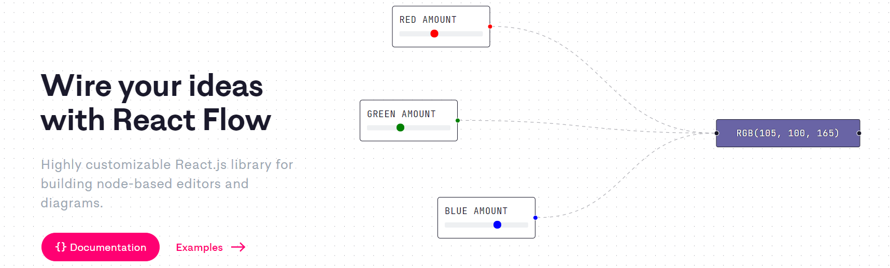

# react flow
> https://reactflow.dev/

## 什么是react-flow
* react-flow是一个用于构建基于节点的静态的、可交互的图形库
## react-flow用到了什么技术
* react
* d3js(部分库)
* redux
* typescript
## 为什么学习react-flow
* uml-editor项目需要用到相关技术
* react-flow实现了自己的画布、图元等(redux用于事件处理), 相当于一个小型的ui库, 有很大的参考价值